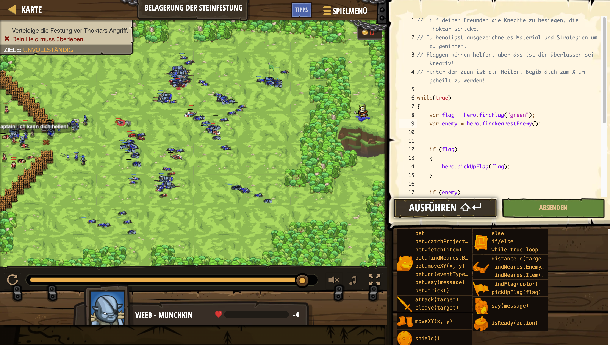

# Level Nummer: 34 - Belagerung der Steinfestung



```js
// Hilf deinen Freunden die Knechte zu besiegen, die Thoktar schickt.
// Du benötigst ausgezeichnetes Material und Strategien um zu gewinnen.
// Flaggen können helfen, aber das ist dir überlassen–sei kreativ!
// Hinter dem Zaun ist ein Heiler. Begib dich zum X um geheilt zu werden!

while(true) {
    var flag = hero.findFlag("green");
    var enemy = hero.findNearestEnemy();
    
    if (flag) {
        hero.pickUpFlag(flag);
    }
    
    if (enemy) {
        if (hero.isReady("cleave")) {
            hero.cleave(enemy);
        }
        else {
            hero.attack(enemy);
        }
    }
}
```