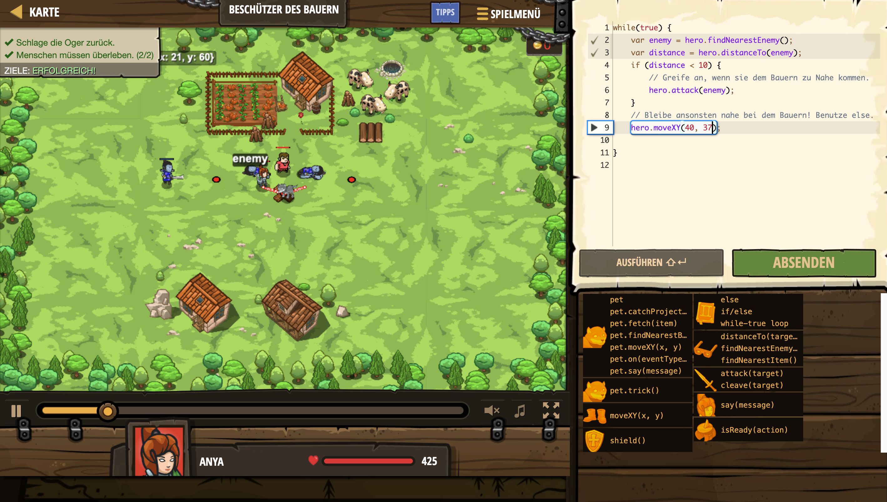

# Level Nummer: 9 - Beschützer des Bauern



```js
while(true) {
    var enemy = hero.findNearestEnemy();
    var distance = hero.distanceTo(enemy);
    if (distance < 10) {
        // Greife an, wenn sie dem Bauern zu Nahe kommen.
        hero.attack(enemy);
    }
    // Bleibe ansonsten nahe bei dem Bauern! Benutze else.
    hero.moveXY(40, 37);
    
}
```