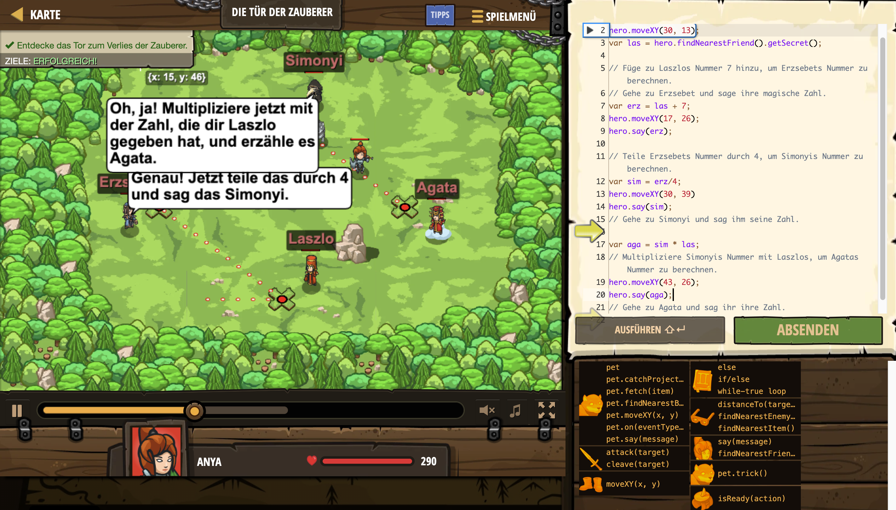

# Level Nummer: 16 - Die Tür der Zauberer



```js
// Gehe zu Laszlo, damit er dir seine Geheimzahl gibt.
hero.moveXY(30, 13);
var las = hero.findNearestFriend().getSecret();

// Füge zu Laszlos Nummer 7 hinzu, um Erzsebets Nummer zu berechnen.
// Gehe zu Erzsebet und sage ihre magische Zahl.
var erz = las + 7;
hero.moveXY(17, 26);
hero.say(erz);

// Teile Erzsebets Nummer durch 4, um Simonyis Nummer zu berechnen.
var sim = erz/4;
hero.moveXY(30, 39)
hero.say(sim);
// Gehe zu Simonyi und sag ihm seine Zahl.

var aga = sim * las;
// Multipliziere Simonyis Nummer mit Laszlos, um Agatas Nummer zu berechnen.
hero.moveXY(43, 26);
hero.say(aga);
// Gehe zu Agata und sag ihr ihre Zahl.
```