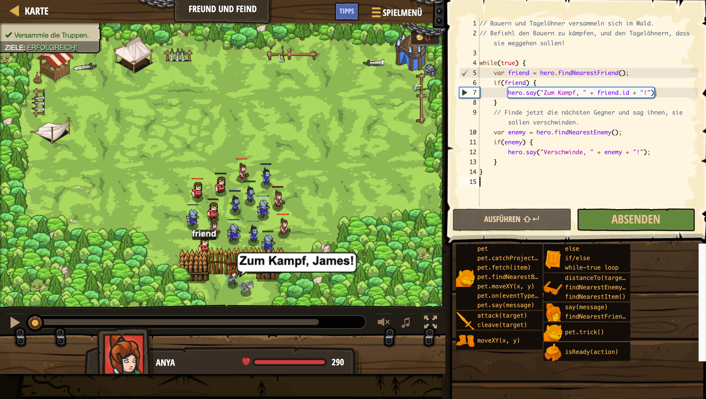

# Level Nummer: 15 - Freund und Feind



```js
// Bauern und Tagelöhner versammeln sich im Wald.
// Befiehl den Bauern zu kämpfen, und den Tagelöhnern, dass sie weggehen sollen!

while(true) {
    var friend = hero.findNearestFriend();
    if(friend) {
        hero.say("Zum Kampf, " + friend.id + "!");
    }
    // Finde jetzt die nächsten Gegner und sag ihnen, sie sollen verschwinden.
    var enemy = hero.findNearestEnemy();
    if(enemy) {
        hero.say("Verschwinde, " + enemy + "!");
    }
}
```