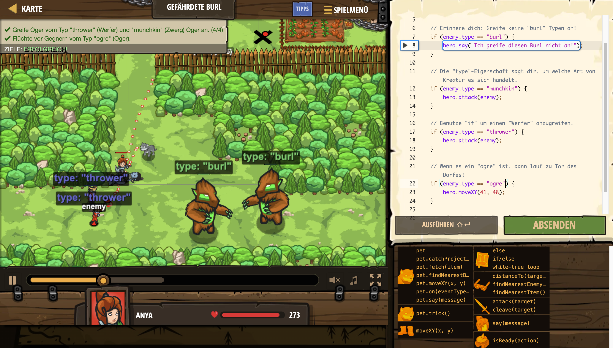

# Level Nummer: 18 - Gefährdete Burl



```js
// Greife nur Feinde vom Typ "munchkin" und "thrower" an.
// Greife keinen „burl“ an. Lauf vor einem „ogre“ weg!
while(true) {
    var enemy = hero.findNearestEnemy();
    
    // Erinnere dich: Greife keine "burl" Typen an!
    if (enemy.type == "burl") {
        hero.say("Ich greife diesen Burl nicht an!");
    }
    
    // Die "type"-Eigenschaft sagt dir, um welche Art von Kreatur es sich handelt.
    if (enemy.type == "munchkin") {
        hero.attack(enemy);
    }
    
    // Benutze "if" um einen "Werfer" anzugreifen.
    if (enemy.type == "thrower") {
        hero.attack(enemy);
    }
    
    // Wenn es ein "ogre" ist, dann lauf zu Tor des Dorfes!
    if (enemy.type == "ogre") {
        hero.moveXY(41, 48);
    }    
}
```