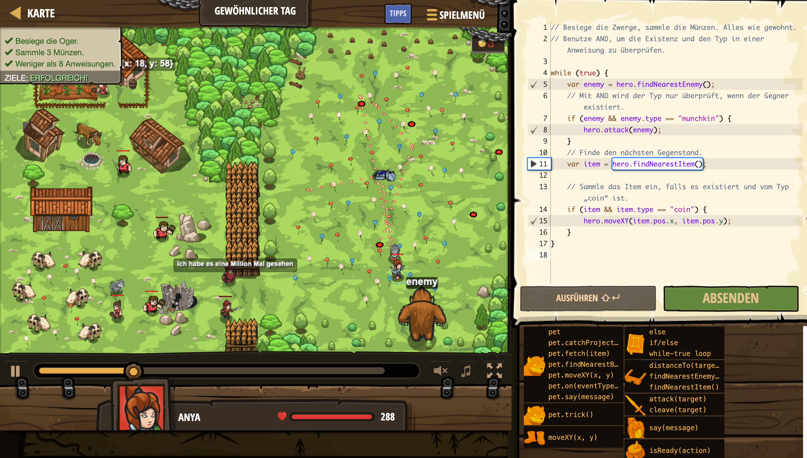

# Level Nummer: 24 - Gewöhnlicher Tag



```js
// Besiege die Zwerge, sammle die Münzen. Alles wie gewohnt.
// Benutze AND, um die Existenz und den Typ in einer Anweisung zu überprüfen.

while (true) {
    var enemy = hero.findNearestEnemy();
    // Mit AND wird der Typ nur überprüft, wenn der Gegner existiert.
    if (enemy && enemy.type == "munchkin") {
        hero.attack(enemy);
    }
    // Finde den nächsten Gegenstand.
    var item = hero.findNearestItem();
    
    // Sammle das Item ein, falls es existiert und vom Typ „coin“ ist.
    if (item && item.type == "coin") {
        hero.moveXY(item.pos.x, item.pos.y);
    }
}
```