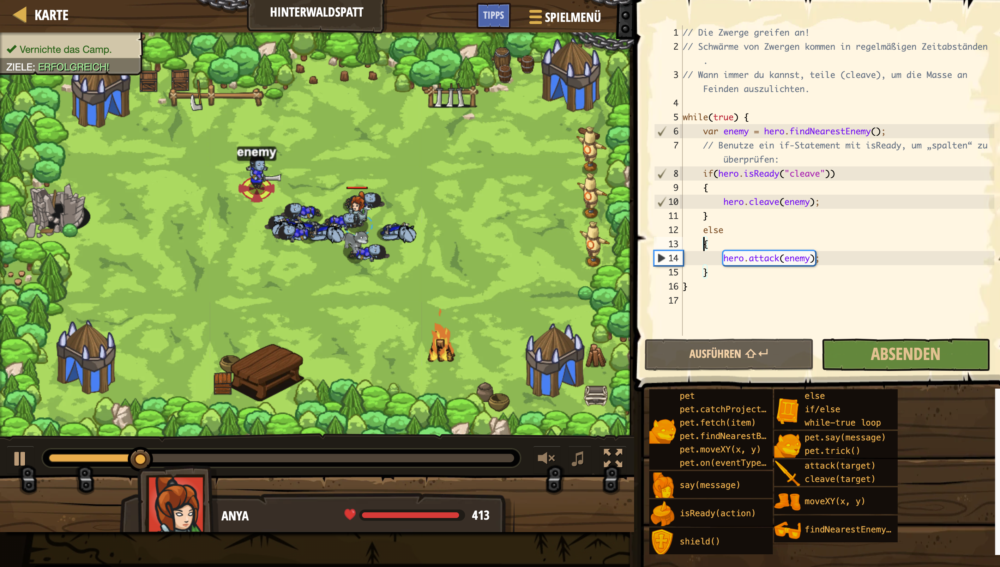

# Level Nummer: 7 - Hinterwaldspatt



```js
// Die Zwerge greifen an!
// Schwärme von Zwergen kommen in regelmäßigen Zeitabständen.
// Wann immer du kannst, teile (cleave), um die Masse an Feinden auszulichten.

while(true) {
    var enemy = hero.findNearestEnemy();
    // Benutze ein if-Statement mit isReady, um „spalten“ zu überprüfen:
    if(hero.isReady("cleave"))
    {
        hero.cleave(enemy);
    }
    else 
    {
        hero.attack(enemy);
    }
}
```