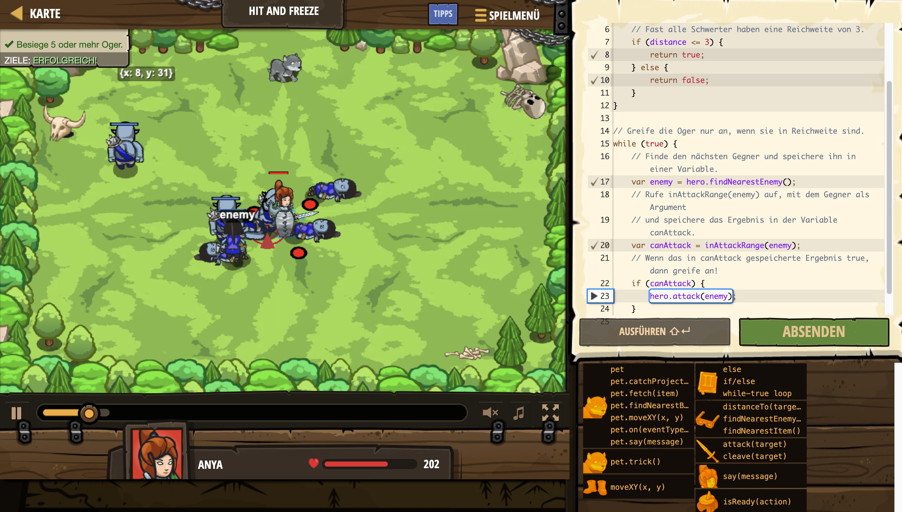

# Level Nummer: 21 - Hit and Freeze



```js
// Du bist gefangen. Bewege dich nicht, es wird wehtun.

// Diese Funktion prüft, ob der Gegner in deiner Angriffsreichweite ist.
function inAttackRange(enemy) {
    var distance = hero.distanceTo(enemy);
    // Fast alle Schwerter haben eine Reichweite von 3.
    if (distance <= 3) {
        return true;
    } else {
        return false;
    }
}

// Greife die Oger nur an, wenn sie in Reichweite sind.
while (true) {
    // Finde den nächsten Gegner und speichere ihn in einer Variable.
    var enemy = hero.findNearestEnemy();
    // Rufe inAttackRange(enemy) auf, mit dem Gegner als Argument
    // und speichere das Ergebnis in der Variable canAttack.
    var canAttack = inAttackRange(enemy);
    // Wenn das in canAttack gespeicherte Ergebnis true, dann greife an!
    if (canAttack) {
        hero.attack(enemy);
    }
}
```