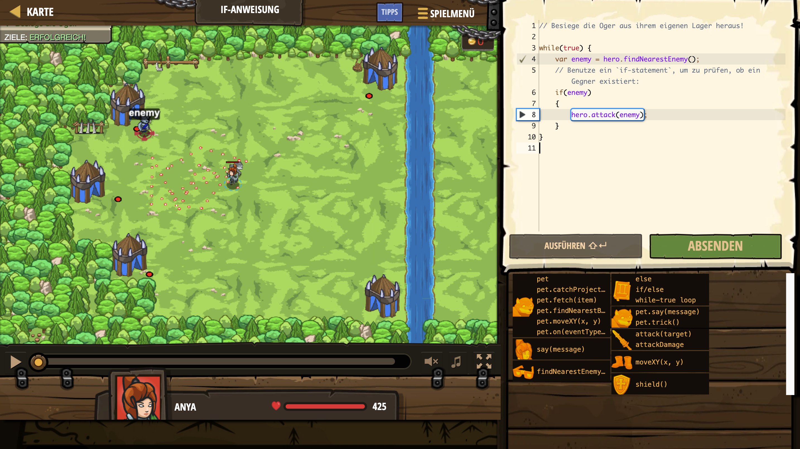

# Level Nummer: 4 - If-Anweisung



```js
// Besiege die Oger aus ihrem eigenen Lager heraus!

while(true) {
    var enemy = hero.findNearestEnemy();
    // Benutze ein `if-statement`, um zu prüfen, ob ein Gegner existiert:
    if(enemy)
    {
        hero.attack(enemy);
    }
}
```