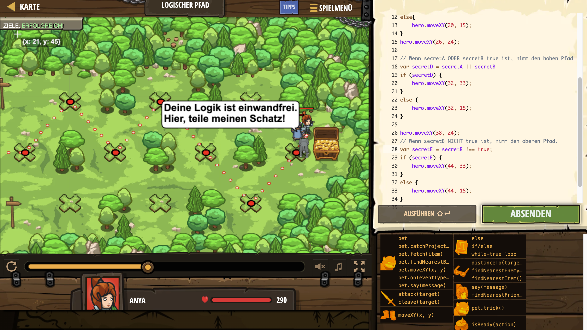

# Level Nummer: 26 - Logischer Pfad



```js
// Hole dir zwei true/false-Werte vom Zauberer.
// In der Anleitung findest du Hinweise dazu, wie man logische Ausdrücke schreibt.
hero.moveXY(14, 24);
var secretA = hero.findNearestFriend().getSecretA();
var secretB = hero.findNearestFriend().getSecretB();

// Wenn SOWOHL secretA als auch secretB wahr sind, nimm den hohen Pfad; ansonsten nimm den tiefen Pfad.
var secretC = secretA && secretB;
if (secretC){
    hero.moveXY(20, 33);
}
else{
    hero.moveXY(20, 15);
}
hero.moveXY(26, 24);

// Wenn secretA ODER secretB true ist, nimm den hohen Pfad
var secretD = secretA || secretB
if (secretD) {
    hero.moveXY(32, 33);
}
else {
    hero.moveXY(32, 15);
}

hero.moveXY(38, 24);
// Wenn secretB NICHT true ist, nimm den oberen Pfad.
var secretE = secretB !== true;
if (secretE) {
    hero.moveXY(44, 33);
}
else {
    hero.moveXY(44, 15);
}

hero.moveXY(50, 24);
```