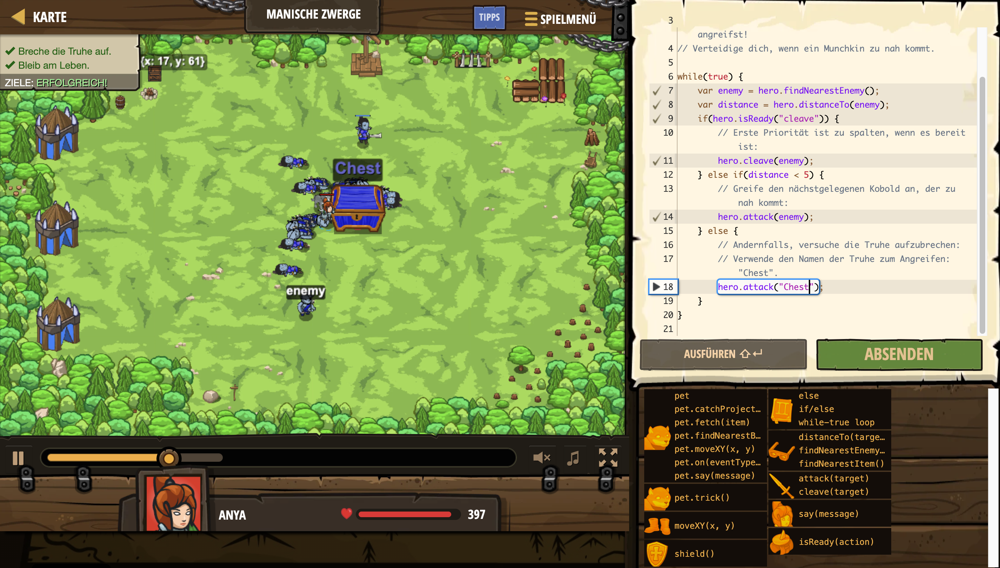

# Level Nummer: 10 - Manische Zwerge



```js
// Eine andere Kiste im Feld, die der Held aufbrechen kann!
// Greif die Truhe an, um sie zu öffnen.
// Manche Zwerge sehen nicht tatenlos zu, wie du es angreifst!
// Verteidige dich, wenn ein Munchkin zu nah kommt.

while(true) {
    var enemy = hero.findNearestEnemy();
    var distance = hero.distanceTo(enemy);
    if(hero.isReady("cleave")) {
        // Erste Priorität ist zu spalten, wenn es bereit ist:
        hero.cleave(enemy);
    } else if(distance < 5) {
        // Greife den nächstgelegenen Kobold an, der zu nah kommt:
        hero.attack(enemy);
    } else {
        // Andernfalls, versuche die Truhe aufzubrechen:
        // Verwende den Namen der Truhe zum Angreifen: "Chest".
        hero.attack("Chest");
    }
}
```