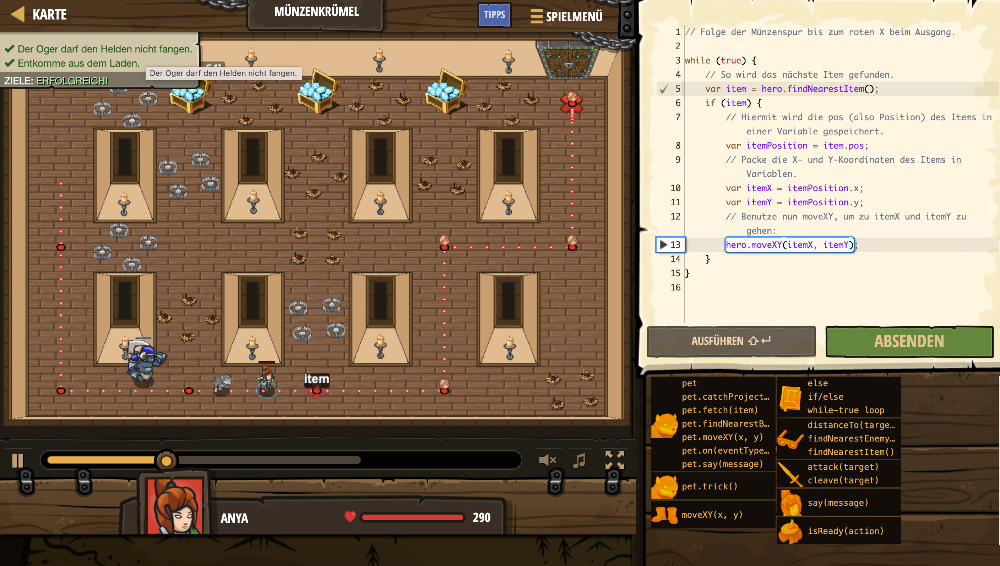

# Level Nummer: 17 - Münzenkrümel



```js
// Folge der Münzenspur bis zum roten X beim Ausgang.

while (true) {
    // So wird das nächste Item gefunden.
    var item = hero.findNearestItem();
    if (item) {
        // Hiermit wird die pos (also Position) des Items in einer Variable gespeichert.
        var itemPosition = item.pos;
        // Packe die X- und Y-Koordinaten des Items in Variablen.
        var itemX = itemPosition.x;
        var itemY = itemPosition.y;
        // Benutze nun moveXY, um zu itemX und itemY zu gehen:
        hero.moveXY(itemX, itemY);
    }
}
```