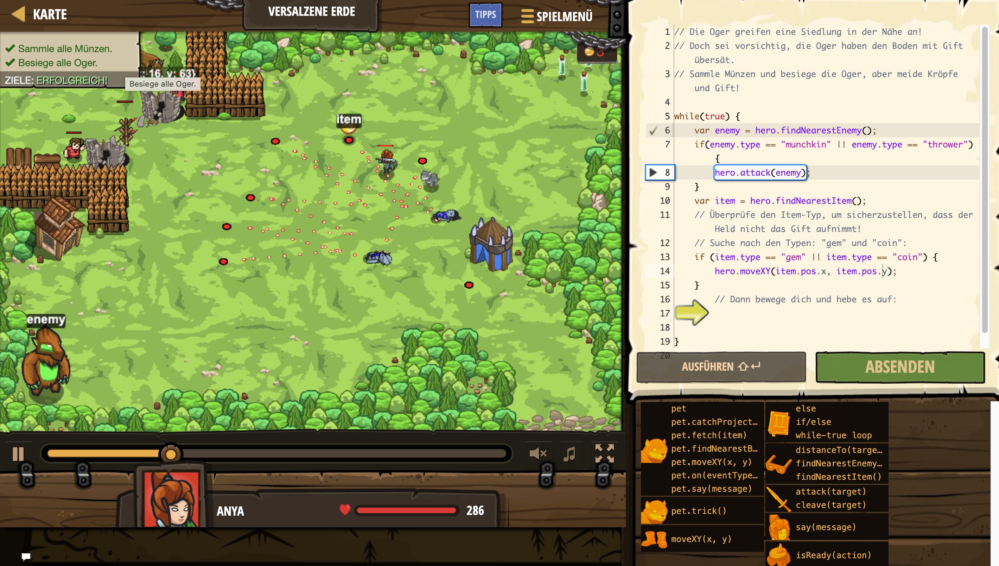

# Level Nummer: 22 - Versalzene Erde



```js
// Die Oger greifen eine Siedlung in der Nähe an!
// Doch sei vorsichtig, die Oger haben den Boden mit Gift übersät.
// Sammle Münzen und besiege die Oger, aber meide Kröpfe und Gift!

while(true) {
    var enemy = hero.findNearestEnemy();
    if(enemy.type == "munchkin" || enemy.type == "thrower") {
        hero.attack(enemy);
    }
    var item = hero.findNearestItem();
    // Überprüfe den Item-Typ, um sicherzustellen, dass der Held nicht das Gift aufnimmt!
    // Suche nach den Typen: "gem" und "coin":
    if (item.type == "gem" || item.type == "coin") {
        // Dann bewege dich und hebe es auf:   
        hero.moveXY(item.pos.x, item.pos.y);
    }
}
```