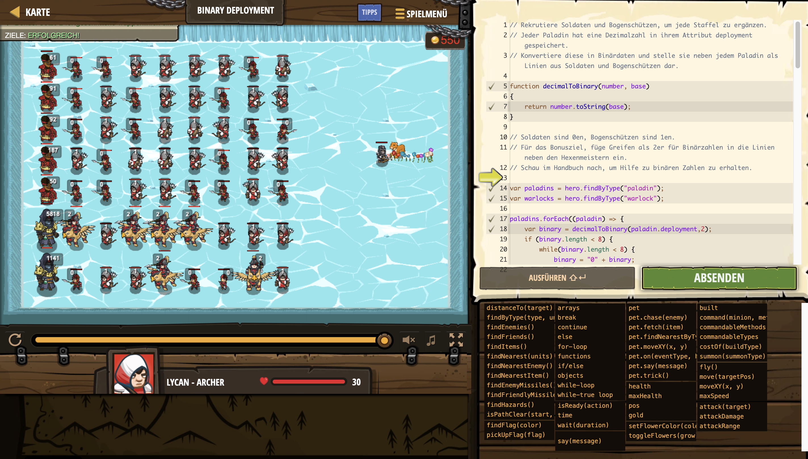

# Level Nummer: 1 - Binary Deployment



```js
// Rekrutiere Soldaten und Bogenschützen, um jede Staffel zu ergänzen.  
// Jeder Paladin hat eine Dezimalzahl in ihrem Attribut deployment gespeichert.
// Konvertiere diese in Binärdaten und stelle sie neben jedem Paladin als Linien aus Soldaten und Bogenschützen dar.

function decimalToBinary(number, base)
{
    return number.toString(base);
}

// Soldaten sind 0en, Bogenschützen sind 1en.
// Für das Bonusziel, füge Greifen als 2er für Binärzahlen in die Linien neben den Hexenmeistern ein.
// Schau im Handbuch nach, um Hilfe zu binären Zahlen zu erhalten.

var paladins = hero.findByType("paladin");
var warlocks = hero.findByType("warlock");

paladins.forEach((paladin) => {
    var binary = decimalToBinary(paladin.deployment,2);
    if (binary.length < 8) {
        while(binary.length < 8) {
            binary = "0" + binary;
        }
    }
    for (let i = 0; i < binary.length; i++) {
        if (Number(binary[i]) === 0) {
            hero.summon("soldier");
        }
        else {
            hero.summon("archer");
        }
    }
});

warlocks.forEach((warlock) => {
    var binary = decimalToBinary(warlock.deployment,3);
    if (binary.length < 8) {
        while(binary.length < 8) {
            binary = "0" + binary;
        }
    }
    for (let i = 0; i < binary.length; i++) {
        if (Number(binary[i]) === 0) {
            hero.summon("soldier");
        }
        else if(Number(binary[i]) === 1) {
            hero.summon("archer");
        }
        else {
            hero.summon("griffin-rider");
        }
    }
});

var soldiers = hero.findByType("soldier");
var archers = hero.findByType("archer");
var griffinRiders = hero.findByType("griffin-rider");

paladins.forEach((paladin) => {
    let offset = 5;
    var binary = decimalToBinary(paladin.deployment,2);
    if (binary.length < 8) {
        while(binary.length < 8) {
            binary = "0" + binary;
        }
    }
    for (let i = 0; i < binary.length; i++) {
        if (Number(binary[i]) === 0) {
            let soldier = soldiers.pop();
            soldier.underOrder = true;
            hero.command(soldier, "move", {x:paladin.pos.x + offset, y: paladin.pos.y});
            offset += 5;
        }
        else {
            let archer = archers.pop();
            archer.underOrder = true;
            hero.command(archer, "move", {x:paladin.pos.x + offset, y: paladin.pos.y});
            offset += 5;
        }
    }
});

warlocks.forEach((warlock) => {
    let offset = 5;
    var binary = decimalToBinary(warlock.deployment,3);
    if (binary.length < 8) {
        while(binary.length < 8) {
            binary = "0" + binary;
        }
    }
    for (let i = 0; i < binary.length; i++) {
        if (Number(binary[i]) === 0) {
            let soldier = soldiers.pop();
            hero.command(soldier, "move", {x:warlock.pos.x + offset, y: warlock.pos.y});
            offset += 5;
        }
        else if (Number(binary[i]) === 1) {
            let archer = archers.pop();
            hero.command(archer, "move", {x:warlock.pos.x + offset, y: warlock.pos.y});
            offset += 5;
        }
        else {
            let griffinRider = griffinRiders.pop();
            hero.command(griffinRider, "move", {x:warlock.pos.x + offset, y: warlock.pos.y});
            offset += 5;
        }
    }
});
```