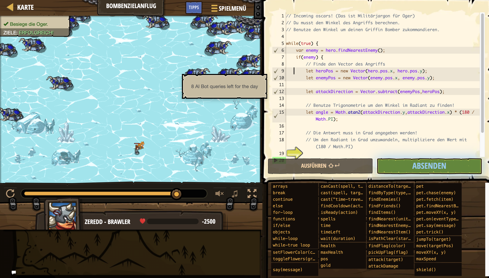

# Level Nummer: 14 - Bombenzielanflug



```js
// Incoming oscars! (Das ist Militärjargon für Oger)
// Du musst den Winkel des Angriffs berechnen.
// Benutze den Winkel um deinen Griffin Bomber zukommandieren.

while(true) {
    var enemy = hero.findNearestEnemy();
    if(enemy) {
        // Finde den Vector des Angriffs
        let heroPos = new Vector(hero.pos.x, hero.pos.y);
        let enemyPos = new Vector(enemy.pos.x, enemy.pos.y);
        
        let attackDirection = Vector.subtract(enemyPos,heroPos);
        
        // Benutze Trigonometrie um den Winkel im Radiant zu finden!
        let angle = Math.atan2(attackDirection.y,attackDirection.x) * (180 / Math.PI);

        // Die Antwort muss in Grad angegeben werden!
        // Um den Radiant in Grad umzuwandeln, multipliziere den Wert mit (180 / Math.PI)
        
        hero.say(angle);
    }
}
```