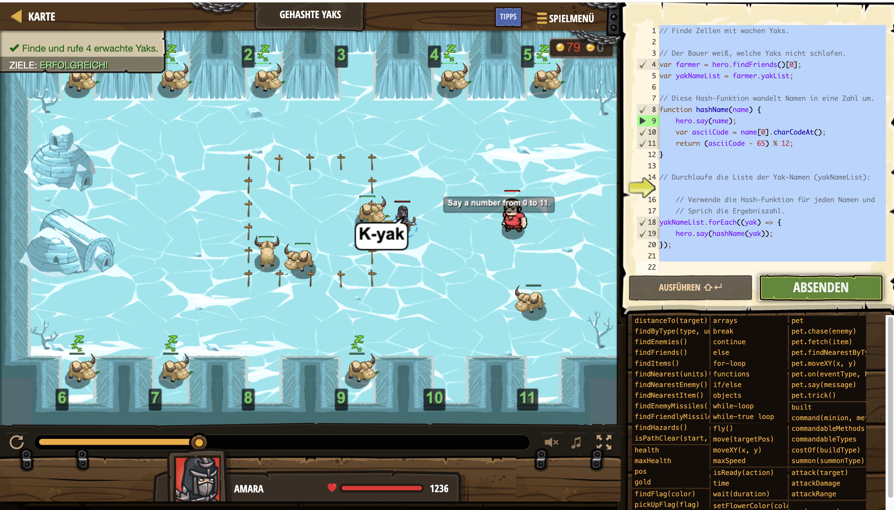

# Level Nummer: 9 - Hashed Yaks



```js
// Finde Zellen mit wachen Yaks.

// Der Bauer weiß, welche Yaks nicht schlafen.
var farmer = hero.findFriends()[0];
var yakNameList = farmer.yakList;

// Diese Hash-Funktion wandelt Namen in eine Zahl um.
function hashName(name) {
    hero.say(name);
    var asciiCode = name[0].charCodeAt();
    return (asciiCode - 65) % 12;
}

// Durchlaufe die Liste der Yak-Namen (yakNameList):

    // Verwende die Hash-Funktion für jeden Namen und
    // Sprich die Ergebniszahl.
yakNameList.forEach((yak) => {
    hero.say(hashName(yak));
});
```