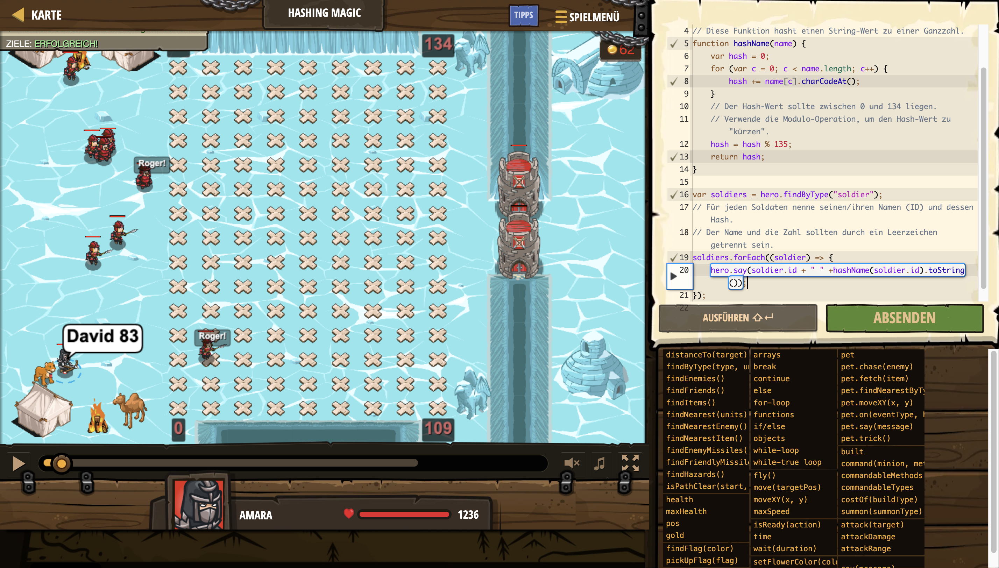

# Level Nummer: 10 - Hashing Magic



```js
// Benutze die Hash-Funktion, um Plätze für Soldaten zu finden.
var totalCells = 135;

// Diese Funktion hasht einen String-Wert zu einer Ganzzahl.
function hashName(name) {
    var hash = 0;
    for (var c = 0; c < name.length; c++) {
        hash += name[c].charCodeAt();
    }
    // Der Hash-Wert sollte zwischen 0 und 134 liegen.
    // Verwende die Modulo-Operation, um den Hash-Wert zu "kürzen".
    hash = hash % 135;
    return hash;
}

var soldiers = hero.findByType("soldier");
// Für jeden Soldaten nenne seinen/ihren Namen (ID) und dessen Hash.
// Der Name und die Zahl sollten durch ein Leerzeichen getrennt sein.
soldiers.forEach((soldier) => {
    hero.say(soldier.id + " " +hashName(soldier.id).toString());
});

```