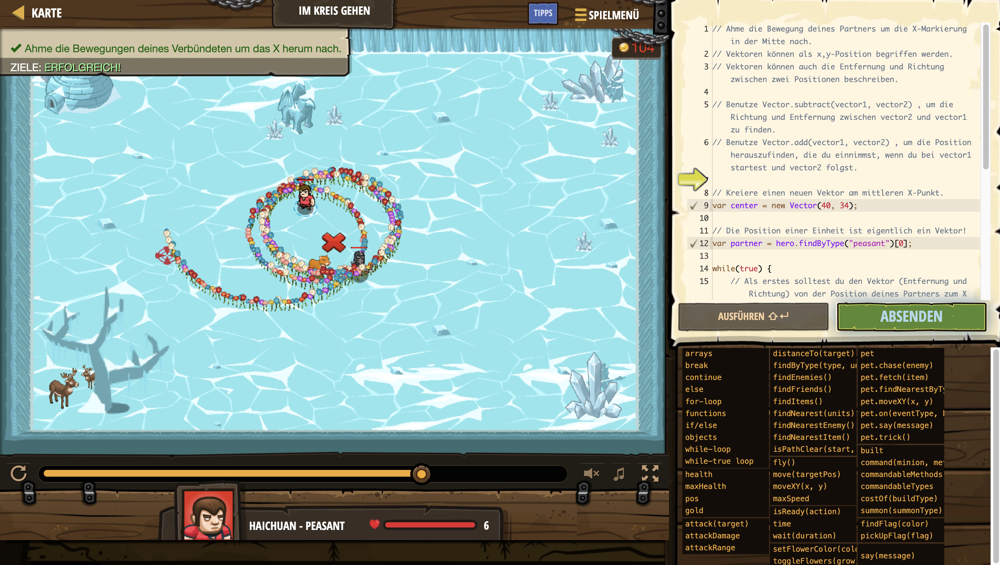

# Level Nummer: 4 - Eisjäger



```js
// Ahme die Bewegung deines Partners um die X-Markierung in der Mitte nach.
// Vektoren können als x,y-Position begriffen werden.
// Vektoren können auch die Entfernung und Richtung zwischen zwei Positionen beschreiben.

// Benutze Vector.subtract(vector1, vector2) , um die Richtung und Entfernung zwischen vector2 und vector1 zu finden.
// Benutze Vector.add(vector1, vector2) , um die Position herauszufinden, die du einnimmst, wenn du bei vector1 startest und vector2 folgst.

// Kreiere einen neuen Vektor am mittleren X-Punkt.
var center = new Vector(40, 34);

// Die Position einer Einheit ist eigentlich ein Vektor!
var partner = hero.findByType("peasant")[0];

while(true) {
    // Als erstes solltest du den Vektor (Entfernung und Richtung) von der Position deines Partners zum X in der Mitte feststellen.
    var vector;
    vector = new Vector(partner.pos.x, partner.pos.y);
    vector = Vector.subtract(center, vector);

    // Als zweites solltest du die Position finden, von der aus dein Held "moveTo" (sich hinbewegen) sollte, beginnend beim Mittelpunkt und dem Vektor folgend.
    
    var moveToPos = Vector.add(center, vector);
    
    hero.move(moveToPos);

    // Als drittes solltest du dich zu der "moveToPos" Position bewegen.

}
```