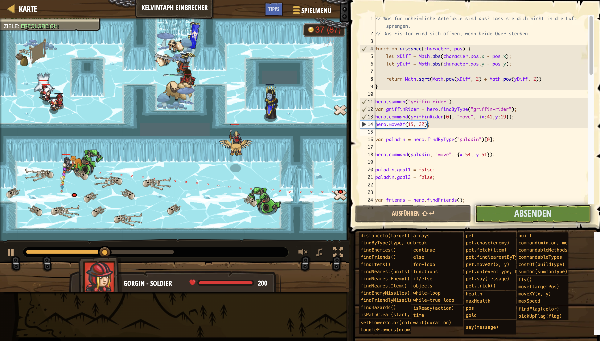

# Level Nummer: 11 - Kelvintaph Einbrecher



```js
// Was für unheimliche Artefakte sind das? Lass sie dich nicht in die Luft sprengen.
// Das Eis-Tor wird sich öffnen, wenn beide Oger sterben.

function distance(character, pos) {
    let xDiff = Math.abs(character.pos.x - pos.x);
    let yDiff = Math.abs(character.pos.y - pos.y);

    return Math.sqrt(Math.pow(xDiff, 2) + Math.pow(yDiff, 2))
}

hero.summon("griffin-rider");
var griffinRider = hero.findByType("griffin-rider");
hero.command(griffinRider[0], "move", {x:41,y:19});
hero.moveXY(15, 22);

var paladin = hero.findByType("paladin")[0];

hero.command(paladin, "move", {x:54, y:51});

paladin.goal1 = false;
paladin.goal2 = false;


var friends = hero.findFriends();

friends.forEach((friend) => {
    friend.reachedDest1 = false;
});

while(true) {
    
    var robotWalkers = hero.findByType("robot-walker")
    
    if (paladin) {
        if (distance(paladin,{x:54, y:51}) < 0.2 && !paladin.goal1) {
            hero.command(paladin, "move",{x:43, y:42});
            paladin.goal1 = true;
        }
        else if (distance(paladin,{x:43, y:42}) < 0.5 && !paladin.goal2) {
            hero.wait(4);
            paladin.goal2 = true;
        }
    }
    
    var friends = hero.findFriends();
    
    if (paladin.goal2 === true) {
        
        friends.forEach((friend) => {
            if (distance(friend, { x: 54, y: 38 }) < 1) {
                friend.reachedDest1 = true;
            }
            else if(!friend.reachedDest1) {
                hero.command(friend, "move",{x:54, y:38});
            }
            
            if (friend.reachedDest1) {
                let target = friend.findNearestEnemy();
                if (target) {
                    hero.command(friend, "attack", target);
                }
                else {
                    hero.command(friend, "move",{x:78, y:40});
                    hero.moveXY(78, 15);
                }
            }

        });
    }
    
    if (robotWalkers.length === 0) {
        hero.command(griffinRider[0], "move", {x:54, y:51});
    }

}
```