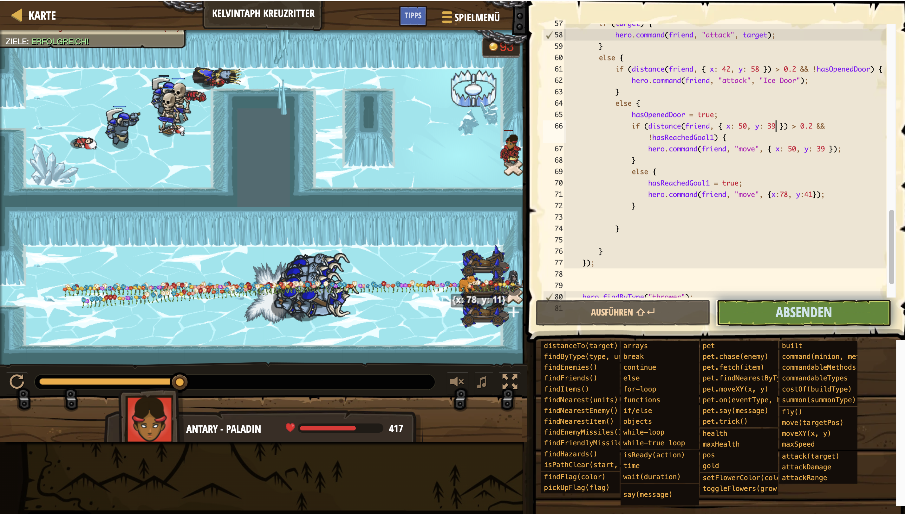

# Level Nummer: 5 - Kelvintaph Kreuzritter


```js
// Du kannst Freunde durch Wände finden, aber keine Feinde
// Halte nach glatten, reibungslosen Eisflicken ausschau!

function distance(character, pos) {
    let xDiff = Math.abs(character.pos.x - pos.x);
    let yDiff = Math.abs(character.pos.y - pos.y);

    return Math.sqrt(Math.pow(xDiff, 2) + Math.pow(yDiff, 2))
}

var moved = false;
var lastAttack = 0;
var attackCoolDown = 0.5;
var hasOpenedDoor = false;
var hasReachedGoal1 = false;

while (true) {

    // Hero Logic
    var brawler = hero.findByType("brawler");
    if (brawler.length > 0) {
        if (!moved) {
            hero.move({ x: 48, y: 15 });
            if (distance(hero, { x: 48, y: 15 }) < 0.2) {
                moved = true;
            }
        }
        else {
            hero.move({ x: 7, y: 14 });
            if (distance(hero, { x: 7, y: 14 }) < 0.2) {
                moved = false;
            }
        }
    }


    if (brawler.length === 0) {
        let enemies = hero.findByType("catapult")
        let enemy = hero.findNearest(enemies);
        if (enemy) {
            hero.attack(enemy);
        }
        else {
            hero.move({x:78, y:15});
        }

    }
    
    
    // Friends Logic
    
    var friends = hero.findFriends();
    
    friends.forEach((friend) => {
        let witch = hero.findByType("witch");
        let target = friend.findNearest(witch)
        if (target) {
            hero.command(friend, "attack", target);
        }
        else {
            if (distance(friend, { x: 42, y: 58 }) > 0.2 && !hasOpenedDoor) {
                hero.command(friend, "attack", "Ice Door");
            }
            else {
                hasOpenedDoor = true;
                if (distance(friend, { x: 50, y: 39 }) > 0.2 && !hasReachedGoal1) {
                    hero.command(friend, "move", { x: 50, y: 39 });
                }
                else {
                    hasReachedGoal1 = true;
                    hero.command(friend, "move", {x:78, y:41});
                }
                
            }
            
        }
    });
    
    
    hero.findByType("thrower");

}

```