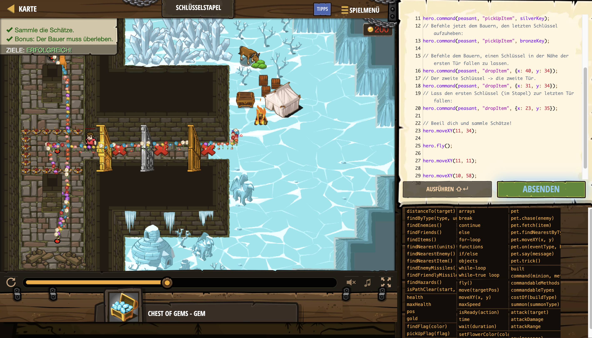

# Level Nummer: 6 - Key Stack



```js
// Türen öffnen und Schätze sammeln.

var peasant = hero.findByType("peasant")[0];

var goldKey = peasant.findByType("gold-key")[0];
var silverKey = peasant.findByType("silver-key")[0];
var bronzeKey = peasant.findByType("bronze-key")[0];

// Befehle den Bauern, die goldenen und silbernen Schlüssel aufzuheben.
hero.command(peasant, "pickUpItem", goldKey);
hero.command(peasant, "pickUpItem", silverKey);
// Befehle jetzt dem Bauern, den letzten Schlüssel aufzuheben:
hero.command(peasant, "pickUpItem", bronzeKey);

// Befehle dem Bauern, einen Schlüssel in der Nähe der ersten Tür fallen zu lassen.
hero.command(peasant, "dropItem", {x: 40, y: 34});
// Der zweite Schlüssel -> die zweite Tür.
hero.command(peasant, "dropItem", {x: 31, y: 34});
// Lass den ersten Schlüssel (im Stapel) zur letzten Tür fallen:
hero.command(peasant, "dropItem", {x: 23, y: 35});

// Beeil dich und sammle Schätze!
hero.moveXY(11, 34);

hero.fly();

hero.moveXY(11, 11);

hero.moveXY(10, 58);
```