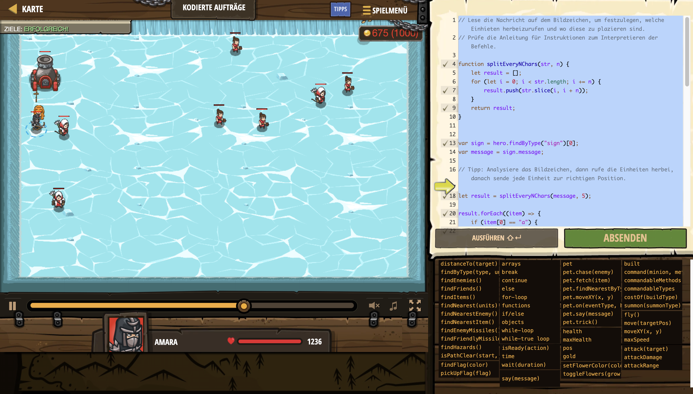

# Level Nummer: 2 - Kodierte Aufträge



```js
// Lese die Nachricht auf dem Bildzeichen, um festzulegen, welche Einhieten herbeizurufen und wo diese zu plazieren sind.
// Prüfe die Anleitung für Instruktionen zum Interpretieren der Befehle.

function splitEveryNChars(str, n) {
    let result = [];
    for (let i = 0; i < str.length; i += n) {
        result.push(str.slice(i, i + n));
    }
    return result;
}


var sign = hero.findByType("sign")[0];
var message = sign.message;

// Tipp: Analysiere das Bildzeichen, dann rufe die Einheiten herbei, danach sende jede Einheit zur richtigen Position.

let result = splitEveryNChars(message, 5);

result.forEach((item) => {
    if (item[0] == "a") {
        hero.summon("archer");
    }
    else if (item[0] == "s") {
        hero.summon("soldier");
    }
    else if (item[0] == "p") {
        hero.summon("peasant");
    }
    else if (item[0] == "g") {
        hero.summon("griffin-rider");
    }
});

var soldiers = hero.findByType("soldier");
var archers = hero.findByType("archer");
var griffinRiders = hero.findByType("griffin-rider");
var pesants = hero.findByType("peasant");

result.forEach((item) => {
    if (item[0] == "a") {
        let archer = archers.pop();
        let xPos = Number(item[1] + item[2]);
        let yPos = Number(item[3] + item[4]);
        hero.command(archer, "move", {x: xPos, y: yPos});
    }
    else if (item[0] == "s") {
        let soldier = soldiers.pop();
        let xPos = Number(item[1] + item[2]);
        let yPos = Number(item[3] + item[4]);
        hero.command(soldier, "move", {x: xPos, y: yPos});
    }
    else if (item[0] == "p") {
        let peasant = pesants.pop();
        let xPos = Number(item[1] + item[2]);
        let yPos = Number(item[3] + item[4]);
        hero.command(peasant, "move", {x: xPos, y: yPos});
    }
    else if (item[0] == "g") {
        let griffinRider = griffinRiders.pop();
        let xPos = Number(item[1] + item[2]);
        let yPos = Number(item[3] + item[4]);
        hero.command(griffinRider, "move", {x: xPos, y: yPos});
    }
});


```