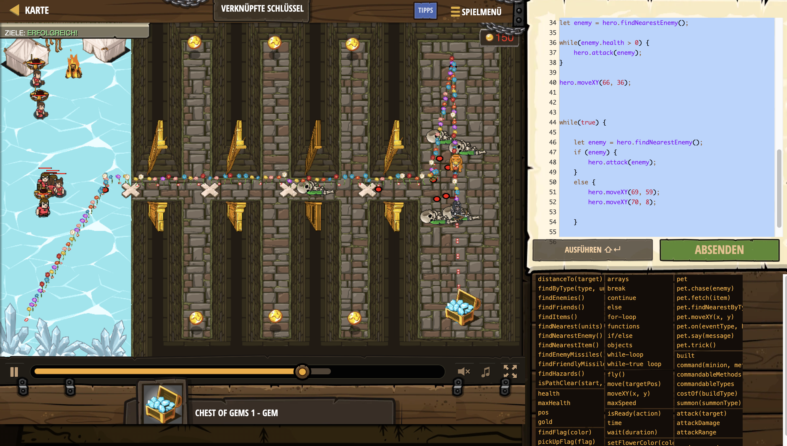

# Level Nummer: 8 - Linked Keys



```js
// Öffne Türen und sammle die Schatztruhe mit Edelsteinen.

// Der nächstgelegene Bauer hat den ersten Schlüssel.
var peasantLinkedList = hero.findNearest(hero.findFriends());
var doorIndex = 0;
var doorDistance = 12;
var peasantsSafe = [];

// Der Listenverweis ist der Verweis auf das erste Element.
var currentPeasant = peasantLinkedList;
peasantsSafe.push(currentPeasant);
while (true) {
    var pos = {x: 20 + doorIndex * doorDistance, y: 34};
    hero.command(currentPeasant, "dropItem", pos);
    // Jedes Element einer verketteten Liste verbindet sich mit dem nächsten
    // Hole das nächste Element mit currentPeasant.next
    currentPeasant = currentPeasant.next;
    // Wenn es kein nächstes Element gibt, endet die Liste.
    if (!currentPeasant) {
        break;
    }
    peasantsSafe.push(currentPeasant); 
    // Erhöhe "doorIndex" um 1.
    doorIndex++;
}

// Türen sind offen. Action!

peasantsSafe.forEach((friend) => {
    hero.command(friend, "move", {x:8, y:34});
});
hero.moveXY(16, 34);

let enemy = hero.findNearestEnemy();

while(enemy.health > 0) {
    hero.attack(enemy);
}

hero.moveXY(66, 36);


while(true) {
    
    let enemy = hero.findNearestEnemy();
    if (enemy) {
        hero.attack(enemy);
    }
    else {
        hero.moveXY(69, 59);
        hero.moveXY(70, 8);
        
    }
    
}

```