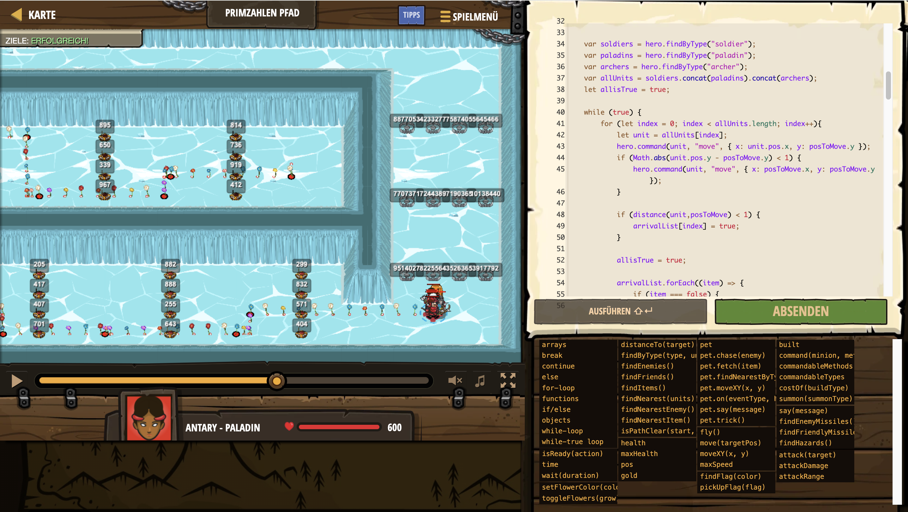

# Level Nummer: 3 - Primzahlen Pfad



```js
// Schaffe alle deine Truppen an das Ende des Weges indem du die aktiven Minen vermeidest.
// Du kannst die Blindgänger finden, indem du die Minen findest, welche eine Primzahl als wert besitzen.
// Überprüfe den Guide zur klarstellung.

function isPrime(num) {
    if (num <= 1) return false; // Numbers less than or equal to 1 are not prime
    if (num <= 3) return true;  // 2 and 3 are prime numbers

    // Eliminate even numbers and multiples of 3
    if (num % 2 === 0 || num % 3 === 0) return false;

    // Check divisors from 5 to the square root of num
    for (let i = 5; i * i <= num; i += 6) {
        if (num % i === 0 || num % (i + 2) === 0) return false;
    }

    return true; // If no divisors found, num is prime
}

function distance(character, pos) {
    let xDiff = Math.abs(character.pos.x - pos.x);
    let yDiff = Math.abs(character.pos.y - pos.y);

   return Math.sqrt(Math.pow(xDiff,2) + Math.pow(yDiff,2))
}

function moveEverybody(posToMove) {
    hero.moveXY(hero.pos.x, posToMove.y);
    hero.moveXY(posToMove.x, posToMove.y);

    let arrivalList = [false,false,false,false,false]


    var soldiers = hero.findByType("soldier");
    var paladins = hero.findByType("paladin");
    var archers = hero.findByType("archer");
    var allUnits = soldiers.concat(paladins).concat(archers);
    let allisTrue = true;

    while (true) {
        for (let index = 0; index < allUnits.length; index++){
            let unit = allUnits[index];
            hero.command(unit, "move", { x: unit.pos.x, y: posToMove.y });
            if (Math.abs(unit.pos.y - posToMove.y) < 1) {
                hero.command(unit, "move", { x: posToMove.x, y: posToMove.y });
            }

            if (distance(unit,posToMove) < 1) {
                arrivalList[index] = true;
            }

            allisTrue = true;

            arrivalList.forEach((item) => { 
                if (item === false) {
                    allisTrue = false;
                }
            });

            if (allisTrue) {
                break;
            }
        }
        if (allisTrue) {
            break;
        }
    }

}

var items = hero.findHazards();

for (let i = items.length - 1; i >= 0; i--) {
    if (items[i].pos.x !== 60) {
        items.splice(i, 1);
    }
}

let posToMove = { x: 50, y: 0 }

items.forEach((item) => {
    if (isPrime(item.value)) {
        posToMove.y = item.pos.y;
    }
})

moveEverybody(posToMove);


items = hero.findHazards();

for (let x = items.length - 1; x >= 0; x--) {
    if (items[x].pos.x !== 40) {
        items.splice(x, 1);
    }
}

posToMove = { x: 30, y: 0 }

items.forEach((item) => {
    if (isPrime(item.value)) {
        posToMove.y = item.pos.y;
    }
})

moveEverybody(posToMove);

items = hero.findHazards();

for (let y = items.length - 1; y >= 0; y--) {
    if (items[y].pos.x !== 20) {
        items.splice(y, 1);
    }
}

posToMove = { x: 5, y: 0 }

items.forEach((item) => {
    if (isPrime(item.value)) {
        posToMove.y = item.pos.y;
    }
})

moveEverybody(posToMove);

posToMove = { x: 5, y: 13 }

moveEverybody(posToMove);

items = hero.findHazards();

for (let z = items.length - 1; z >= 0; z--) {
    if (items[z].pos.x !== 10) {
        items.splice(z, 1);
    }
}

posToMove = { x: 20, y: 0 }

items.forEach((item) => {
    if (isPrime(item.value)) {
        posToMove.y = item.pos.y;
    }
})

moveEverybody(posToMove);

items = hero.findHazards();

for (let a = items.length - 1; a >= 0; a--) {
    if (items[a].pos.x !== 30) {
        items.splice(a, 1);
    }
}

posToMove = { x: 40, y: 0 }

items.forEach((item) => {
    if (isPrime(item.value)) {
        posToMove.y = item.pos.y;
    }
})

moveEverybody(posToMove);

items = hero.findHazards();

for (let b = items.length - 1; b >= 0; b--) {
    if (items[b].pos.x !== 50) {
        items.splice(b, 1);
    }
}

posToMove = { x: 60, y: 0 }

items.forEach((item) => {
    if (isPrime(item.value)) {
        posToMove.y = item.pos.y;
    }
})

moveEverybody(posToMove);

items = hero.findHazards();

for (let c = items.length - 1; c >= 0; c--) {
    if (items[c].pos.x !== 70) {
        items.splice(c, 1);
    }
}

posToMove = { x: 90, y: 0 }

items.forEach((item) => {
    if (isPrime(item.value)) {
        posToMove.y = item.pos.y;
    }
})

moveEverybody(posToMove);

```