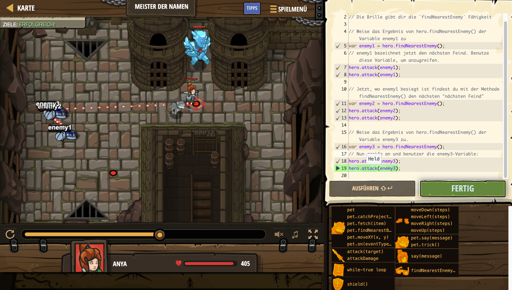

# Level Nummer: 16 - Meister der Namen



```js
// Dein Held kennt die Namen dieser Feinde nicht!
// Die Brille gibt dir die `findNearestEnemy` Fähigkeit

// Weise das Ergebnis von hero.findNearestEnemy() der Variable enemy1 zu
var enemy1 = hero.findNearestEnemy();
// enemy1 bezeichnet jetzt den nächsten Feind. Benutze diese Variable, um anzugreifen.
hero.attack(enemy1);
hero.attack(enemy1);

// Jetzt, wo enemy1 besiegt ist findest du mit der Methode findNearestEnemy() den nächsten "nächsten Feind"
var enemy2 = hero.findNearestEnemy();
hero.attack(enemy2);
hero.attack(enemy2);

// Weise das Ergebnis von hero.findNearestEnemy() der Variable enemy3 zu.
var enemy3 = hero.findNearestEnemy();
// Nun greife an und benutzer die enemy3-Variable:
hero.attack(enemy3);
hero.attack(enemy3);
```