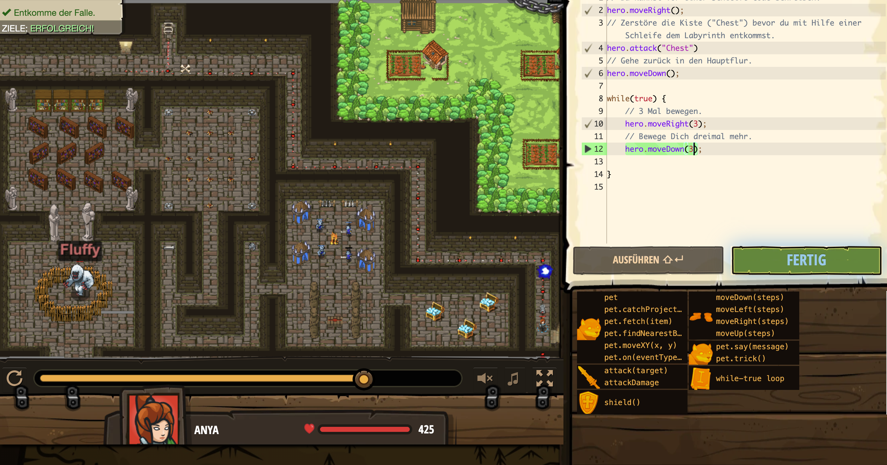

# Level Nummer: 13 - Schlagen und Laufen



```js
// Du kannst vor einer Schleife Code schreiben.
hero.moveRight();
// Zerstöre die Kiste ("Chest") bevor du mit Hilfe einer Schleife dem Labyrinth entkommst.
hero.attack("Chest")
// Gehe zurück in den Hauptflur.
hero.moveDown();

while(true) {
    // 3 Mal bewegen.
    hero.moveRight(3);
    // Bewege Dich dreimal mehr.
    hero.moveDown(3);
    
}
```