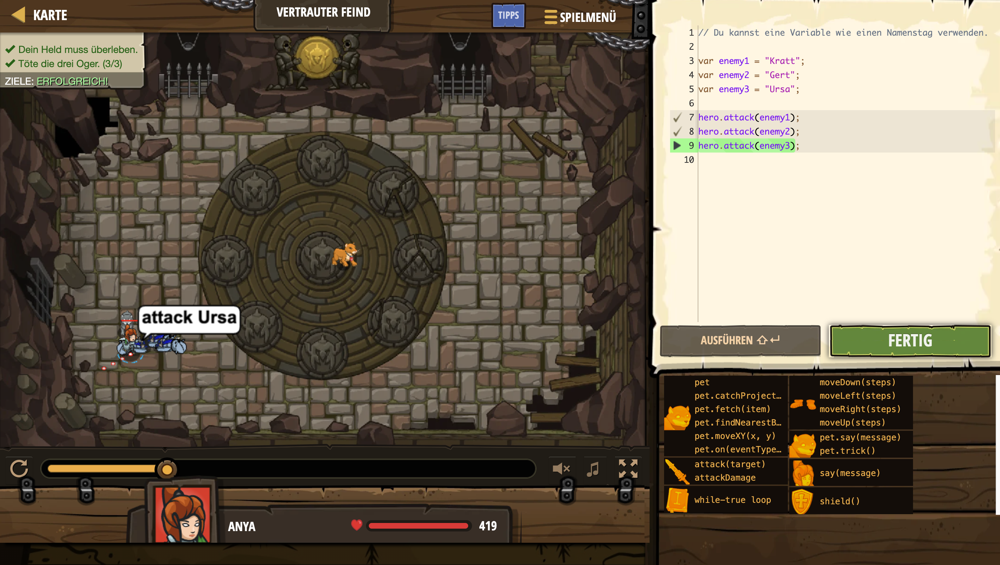

# Level Nummer: 15 - Vertrauter Feind




```js
// Du kannst eine Variable wie einen Namenstag verwenden.

var enemy1 = "Kratt";
var enemy2 = "Gert";
var enemy3 = "Ursa";

hero.attack(enemy1);
hero.attack(enemy2);
hero.attack(enemy3);
```