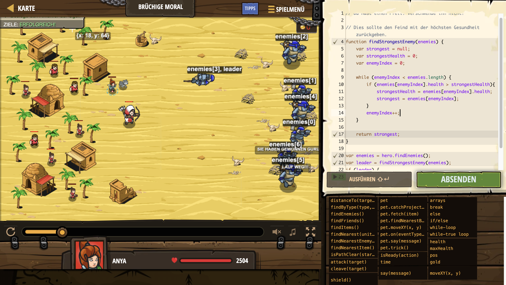

# Level Nummer: 25 - Brüchige Moral



```js
// Du hast einen Pfeil. Verschwende ihn nicht!

// Dies sollte den Feind mit der höchsten Gesundheit zurückgeben.
function findStrongestEnemy(enemies) {
    var strongest = null;
    var strongestHealth = 0;
    var enemyIndex = 0;
    
    while (enemyIndex < enemies.length) {
        if (enemies[enemyIndex].health > strongestHealth){
            strongestHealth = enemies[enemyIndex].health;
            strongest = enemies[enemyIndex];
        }
        enemyIndex++;
    }
        
    return strongest;
}

var enemies = hero.findEnemies();
var leader = findStrongestEnemy(enemies);
if (leader) {
    hero.say(leader);
}

```