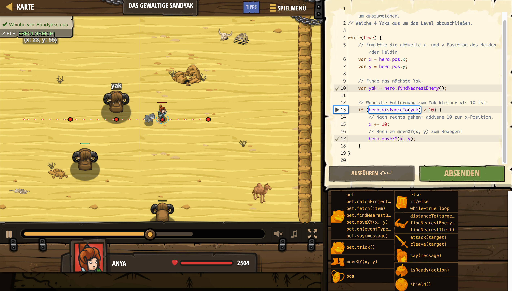

# Level Nummer: 1 - Das gewaltige Sandyak



```js
// Lass die Yaks rankommen und laufe dann 10m nach rechts um auszuweichen.
// Weiche 4 Yaks aus um das Level abzuschließen.

while(true) {
    // Ermittle die aktuelle x- und y-Position des Helden/der Heldin
    var x = hero.pos.x;
    var y = hero.pos.y;
    
    // Finde das nächste Yak.
    var yak = hero.findNearestEnemy();
    
    // Wenn die Entfernung zum Yak kleiner als 10 ist:
    if (hero.distanceTo(yak) < 10) {
        // Nach rechts gehen: addiere 10 zur x-Position.
        x += 10;
        // Benutze moveXY(x, y) zum Bewegen!
        hero.moveXY(x, y);
    }
}
```