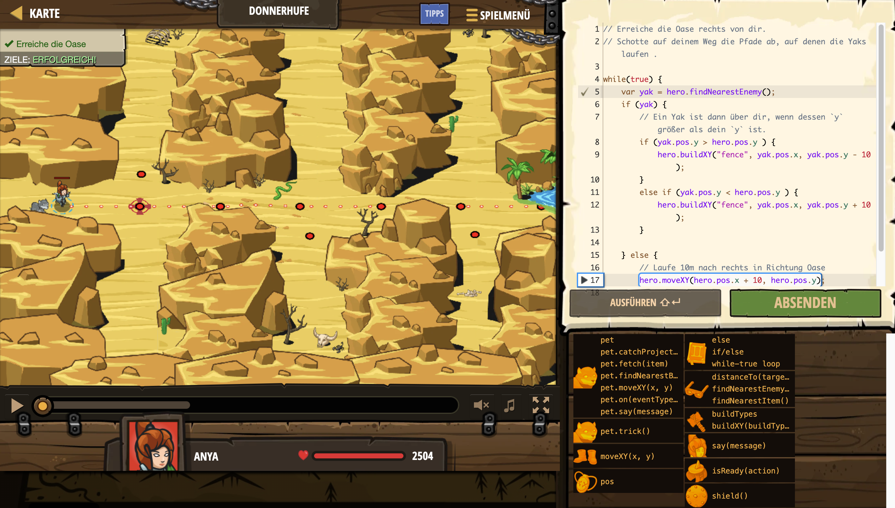

# Level Nummer: 6 - Donnerhufe



```js
// Erreiche die Oase rechts von dir.
// Schotte auf deinem Weg die Pfade ab, auf denen die Yaks laufen .

while(true) {
    var yak = hero.findNearestEnemy();
    if (yak) {
        // Ein Yak ist dann über dir, wenn dessen `y` größer als dein `y` ist.
        if (yak.pos.y > hero.pos.y ) {
            hero.buildXY("fence", yak.pos.x, yak.pos.y - 10);
        }
        else if (yak.pos.y < hero.pos.y ) {
            hero.buildXY("fence", yak.pos.x, yak.pos.y + 10);
        }
            
    } else {
        // Laufe 10m nach rechts in Richtung Oase
        hero.moveXY(hero.pos.x + 10, hero.pos.y);
    }
}
```