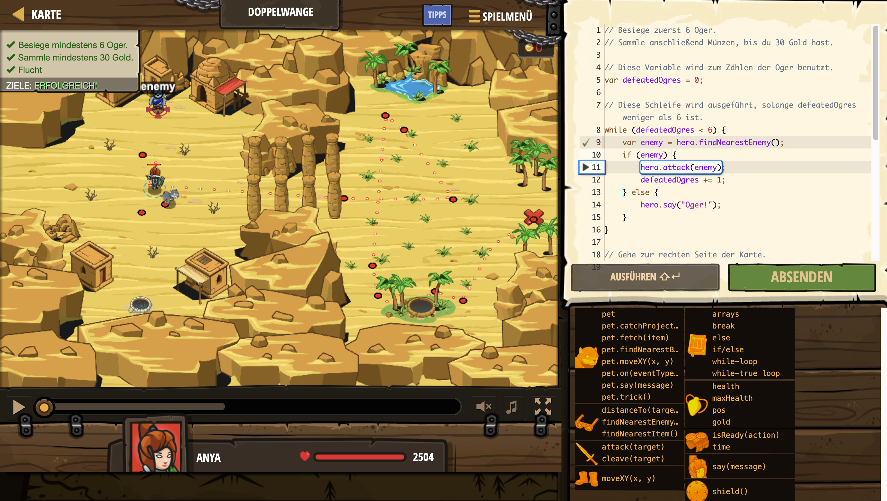

# Level Nummer: 12 - Doppelwange



```js
// Besiege zuerst 6 Oger.
// Sammle anschließend Münzen, bis du 30 Gold hast.

// Diese Variable wird zum Zählen der Oger benutzt.
var defeatedOgres = 0;

// Diese Schleife wird ausgeführt, solange defeatedOgres weniger als 6 ist.
while (defeatedOgres < 6) {
    var enemy = hero.findNearestEnemy();
    if (enemy) {
        hero.attack(enemy);
        defeatedOgres += 1;
    } else {
        hero.say("Oger!");
    }
}

// Gehe zur rechten Seite der Karte.
hero.moveXY(49, 36);

// Diese Schleife wird ausgeführt, solange du weniger als 30 Gold hast.
while (hero.gold < 30) {
    // Finde und sammle Münzen.
    var coin = hero.findNearestItem();
    
    if (coin) {
        hero.moveXY(coin.pos.x, coin.pos.y);
    } 
}

// Geh zum Ausgang.
hero.moveXY(76, 32);

```