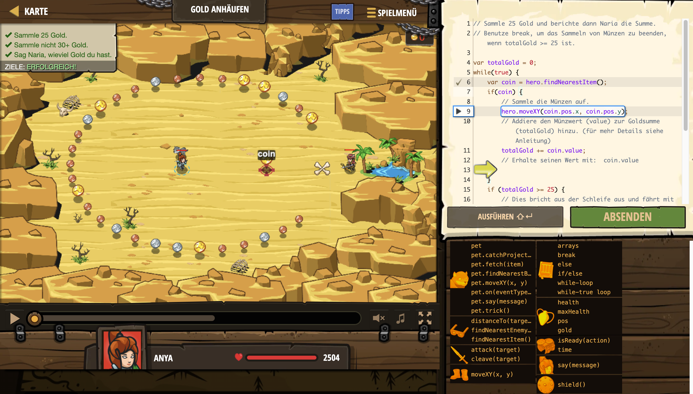

# Level Nummer: 10 - Gold anhäufen



```js
// Sammle 25 Gold und berichte dann Naria die Summe.
// Benutze break, um das Sammeln von Münzen zu beenden, wenn totalGold >= 25 ist.

var totalGold = 0;
while(true) {
    var coin = hero.findNearestItem();
    if(coin) {
        // Sammle die Münzen auf.
        hero.moveXY(coin.pos.x, coin.pos.y);
        // Addiere den Münzwert (value) zur Goldsumme (totalGold) hinzu. (für mehr Details siehe Anleitung)
        totalGold += coin.value;
        // Erhalte seinen Wert mit:  coin.value
        
    }
    if (totalGold >= 25) {
        // Dies bricht aus der Schleife aus und fährt mit dem Code darunter fort.
        // Die Schleife ist beendet, jetzt wird der Code nach der Schleife ausgeführt.
        break;
    }
}

// Genug Gold gesammelt!
hero.moveXY(58, 33);
// Gehe zu Naria und sage, wieviel Gold du gesammelt hast.
hero.say(totalGold);
```