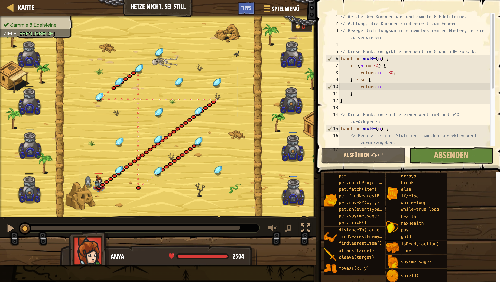

# Level Nummer: 15 - Hetze nicht, sei still



```js
// Weiche den Kanonen aus und sammle 8 Edelsteine.
// Achtung, die Kanonen sind bereit zum Feuern!
// Bewege dich langsam in einem bestimmten Muster, um sie zu verwirren.

// Diese Funktion gibt einen Wert >= 0 und <30 zurück:
function mod30(n) {
    if (n >= 30) {
        return n - 30;
    } else {
        return n;
    }
}

// Diese Funktion sollte einen Wert >=0 und <40 zurückgeben:
function mod40(n) {
    // Benutze ein if-Statement, um den korrekten Wert zurückzugeben.
    if (n >= 40) {
        return n - 40;
    }
    return n;
}

// Ändere den folgenden Code nicht:
while (true) {
    var time = hero.time;
    var x = mod30(time) + 25;
    var y = mod40(time) + 10;
    hero.moveXY(x, y);
}
```