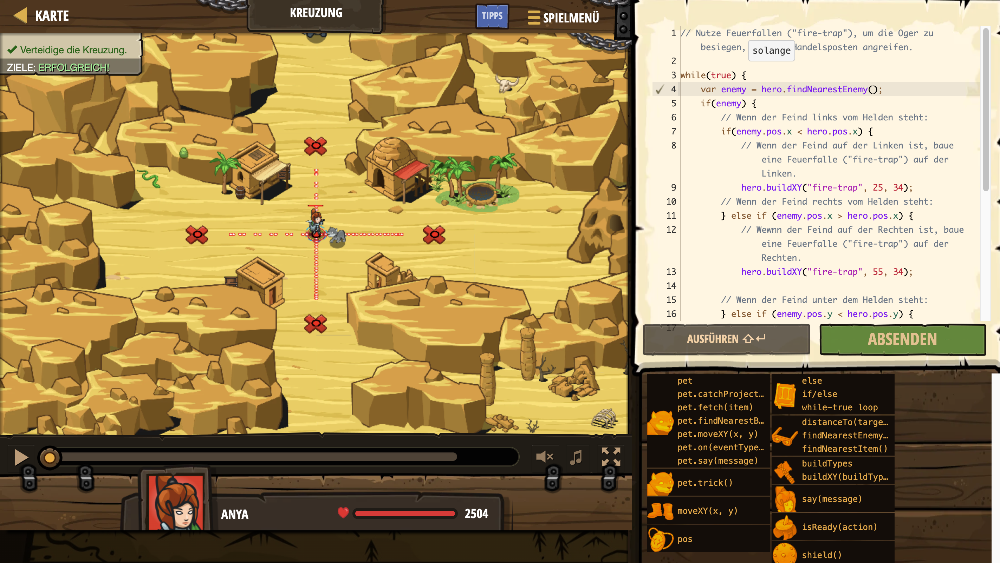

# Level Nummer: 5 - Kreuzung



```js
// Nutze Feuerfallen ("fire-trap"), um die Oger zu besiegen, die den Handelsposten angreifen.

while(true) {
    var enemy = hero.findNearestEnemy();
    if(enemy) {
        // Wenn der Feind links vom Helden steht:
        if(enemy.pos.x < hero.pos.x) {
            // Wenn der Feind auf der Linken ist, baue eine Feuerfalle ("fire-trap") auf der Linken.
            hero.buildXY("fire-trap", 25, 34);
        // Wenn der Feind rechts vom Helden steht:
        } else if (enemy.pos.x > hero.pos.x) {
            // Wewnn der Feind auf der Rechten ist, baue eine Feuerfalle ("fire-trap") auf der Rechten.
            hero.buildXY("fire-trap", 55, 34);
            
        // Wenn der Feind unter dem Helden steht:
        } else if (enemy.pos.y < hero.pos.y) {
            // Wenn der Feind unterhalb des Helden ist, baue unterhalb eine Feuerfalle ("fire-trap").
            hero.buildXY("fire-trap", 40, 19);
        // Wenn der Feind über dem Helden steht:
        } else if (enemy.pos.y > hero.pos.y) {
            // Wenn der Feind oberhalb des Helden ist, baue oberhalb eine Feuerfalle ("fire-trap").
            hero.buildXY("fire-trap", 40, 49);
        }
    }
    // Gehe zurück in die Mitte
    hero.moveXY(40, 34);
}
```