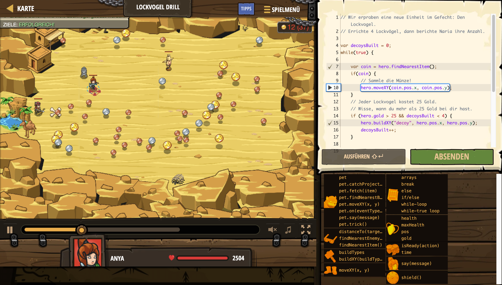

# Level Nummer: 11 - Lockvogel Drill



```js
// Wir erproben eine neue Einheit im Gefecht: Den Lockvogel.
// Errichte 4 Lockvögel, dann berichte Naria ihre Anzahl.

var decoysBuilt = 0;
while(true) {
    
    var coin = hero.findNearestItem();
    if(coin) {
        // Sammle die Münze!
        hero.moveXY(coin.pos.x, coin.pos.y);
    }
    // Jeder Lockvogel kostet 25 Gold.
    // Wisse, wann du mehr als 25 Gold bei dir hast.
    if (hero.gold > 25 && decoysBuilt < 4) {
        hero.buildXY("decoy", hero.pos.x, hero.pos.y);
        decoysBuilt++;
    }
    
    if(decoysBuilt == 4) {
        // Brich die Schleife ab, wenn du 4 errichtet hast
        break;
        
    }
}

hero.say("Errichten von Lockvögel erledigt!");
hero.moveXY(14, 36);
// Geh zu Naria und sage ihr, wie viele Lockvögel du errichtest hast.
hero.say(decoysBuilt);
```