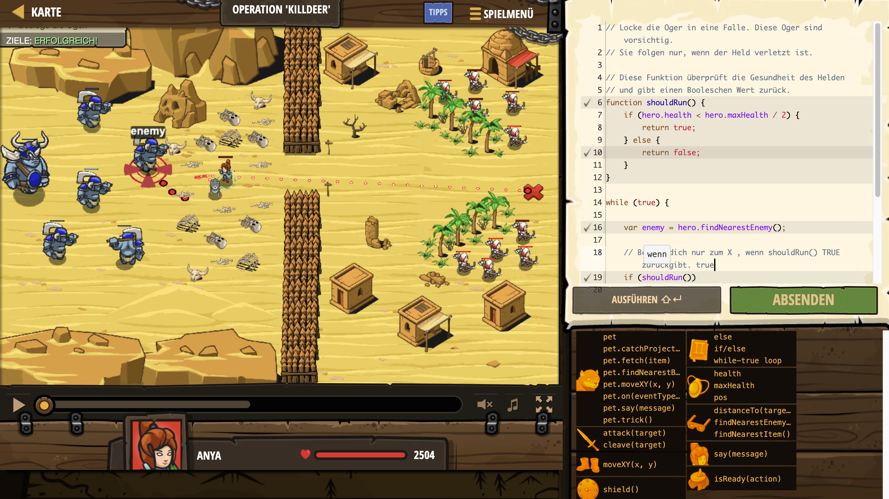

# Level Nummer: 7 - Operation 'Killdeer'



```js
// Locke die Oger in eine Falle. Diese Oger sind vorsichtig.
// Sie folgen nur, wenn der Held verletzt ist.

// Diese Funktion überprüft die Gesundheit des Helden
// und gibt einen Booleschen Wert zurück.
function shouldRun() {
    if (hero.health < hero.maxHealth / 2) {
        return true;
    } else {
        return false;
    }
}

while (true) {
    
    var enemy = hero.findNearestEnemy();
    
    // Bewege dich nur zum X , wenn shouldRun() TRUE zurückgibt. true
    if (shouldRun()) {
        hero.moveXY(75, 37);
    }
    else {
        hero.attack(enemy);
    }
}
```