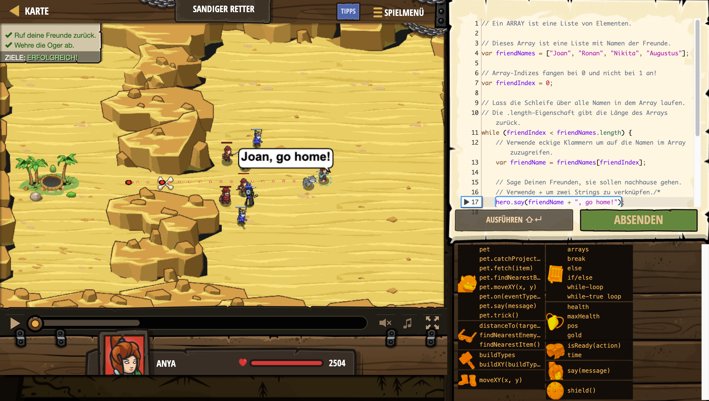

# Level Nummer: 18 - Sandiger Retter



```js
// Ein ARRAY ist eine Liste von Elementen.

// Dieses Array ist eine Liste mit Namen der Freunde.
var friendNames = ["Joan", "Ronan", "Nikita", "Augustus"];

// Array-Indizes fangen bei 0 und nicht bei 1 an!
var friendIndex = 0;

// Lass die Schleife über alle Namen in dem Array laufen.
// Die .length-Eigenschaft gibt die Länge des Arrays zurück.
while (friendIndex < friendNames.length) {
    // Verwende eckige Klammern um auf die Namen im Array zuzugreifen.
    var friendName = friendNames[friendIndex];
    
    // Sage Deinen Freunden, sie sollen nachhause gehen.
    // Verwende + um zwei Strings zu verknüpfen./*
    hero.say(friendName + ", go home!");
    
    // Erhöhe friendIndex um auf den nächsten Namen zugreifen zu können.
    friendIndex++;
}

// Ziehe Dich zur Oase zurück und baue einen Zaun auf dem X.
hero.moveXY(23, 30);
hero.buildXY("fence", 29, 30);
```