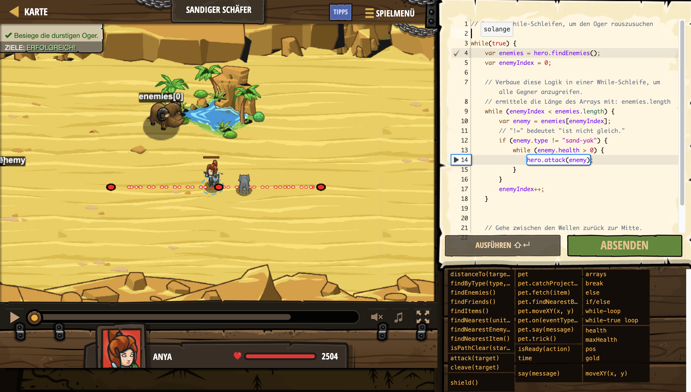

# Level Nummer: 21 - Sandiger Schäfer



```js
// Benutze while-Schleifen, um den Oger rauszusuchen

while(true) {
    var enemies = hero.findEnemies();
    var enemyIndex = 0;

    // Verbaue diese Logik in einer While-Schleife, um alle Gegner anzugreifen.
    // ermittele die Länge des Arrays mit: enemies.length
    while (enemyIndex < enemies.length) {
        var enemy = enemies[enemyIndex];
        // "!=" bedeutet "ist nicht gleich."
        if (enemy.type != "sand-yak") {
            while (enemy.health > 0) {
                hero.attack(enemy);
            }
        }
        enemyIndex++;
    }

    // Gehe zwischen den Wellen zurück zur Mitte.
    hero.moveXY(40, 32);
}
```