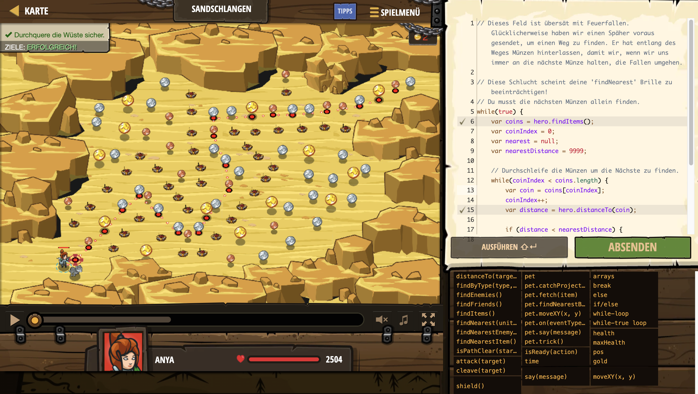

# Level Nummer: 24 - Sandschlangen



```js
// Dieses Feld ist übersät mit Feuerfallen. Glücklicherweise haben wir einen Späher voraus gesendet, um einen Weg zu finden. Er hat entlang des Weges Münzen hinterlassen, damit wir, wenn wir uns immer an die nächste Münze halten, die Fallen umgehen.

// Diese Schlucht scheint deine 'findNearest' Brille zu beeinträchtigen!
// Du musst die nächsten Münzen allein finden.
while(true) {
    var coins = hero.findItems();
    var coinIndex = 0;
    var nearest = null;
    var nearestDistance = 9999;
    
    // Durchschleife die Münzen um die Nächste zu finden.
    while(coinIndex < coins.length) {
        var coin = coins[coinIndex];
        coinIndex++;
        var distance = hero.distanceTo(coin);
        
        if (distance < nearestDistance) {
            nearest = coin;
            nearestDistance = hero.distanceTo(coin);
        }
    }
    // Wenn es eine nächste Münze gibt, gehe zu ihrer Position. Du musst moveXY nutzen, damit du keine Ecken abschneidest und auf Fallen triffst.
    hero.moveXY(nearest.pos.x, nearest.pos.y);
}

```