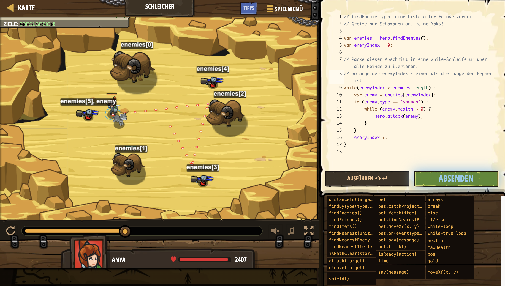

# Level Nummer: 20 - Schleicher



```js
// Warte auf Oger, besiege sie und sammle das Gold.
// findEnemies gibt eine Liste aller Feinde zurück.
// Greife nur Schamanen an, keine Yaks!

var enemies = hero.findEnemies();
var enemyIndex = 0;

// Packe diesen Abschnitt in eine while-Schleife um über alle Feinde zu iterieren.
// Solange der enemyIndex kleiner als die Länge der Gegner ist
while(enemyIndex < enemies.length) {
    var enemy = enemies[enemyIndex];
    if (enemy.type == 'shaman') {
        while (enemy.health > 0) {
            hero.attack(enemy);
        }
    }
    enemyIndex++;
}
```