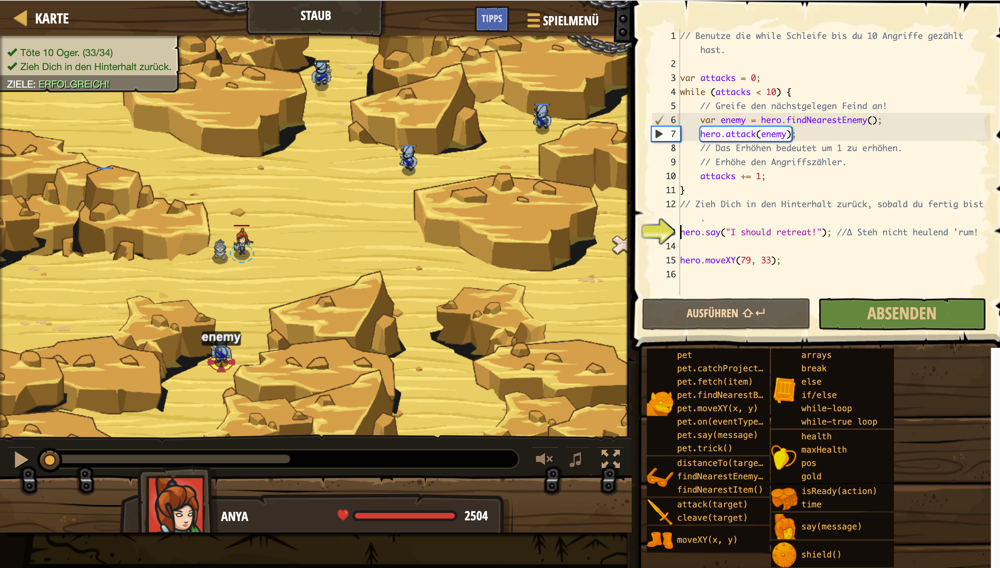

# Level Nummer: 14 - Staub



```js
// Benutze die while Schleife bis du 10 Angriffe gezählt hast.

var attacks = 0;
while (attacks < 10) {
    // Greife den nächstgelegen Feind an!
    var enemy = hero.findNearestEnemy();
    hero.attack(enemy);
    // Das Erhöhen bedeutet um 1 zu erhöhen.
    // Erhöhe den Angriffszähler.
    attacks += 1;
}
// Zieh Dich in den Hinterhalt zurück, sobald du fertig bist.
hero.say("I should retreat!"); //∆ Steh nicht heulend 'rum!

hero.moveXY(79, 33);
```