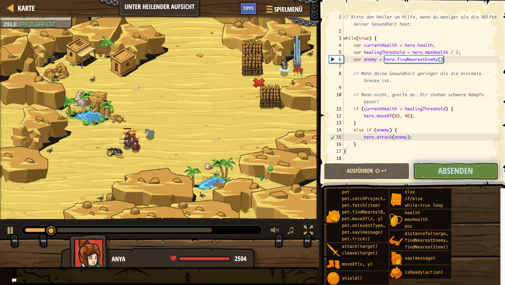

# Level Nummer: 8 - Unter Heilender Aufsicht



```js
// Bitte den Heiler um Hilfe, wenn du weniger als die Hälfte deiner Gesundheit hast.

while(true) {
    var currentHealth = hero.health;
    var healingThreshold = hero.maxHealth / 2;
    var enemy = hero.findNearestEnemy();

    // Wenn deine Gesundheit geringer als die minimale Grenze ist.

    // Wenn nicht, greife an. Dir stehen schwere Kämpfe bevor!
    if (currentHealth < healingThreshold) {
        hero.moveXY(65, 46);
    }
    else if (enemy) {
        hero.attack(enemy);
    }
}
```