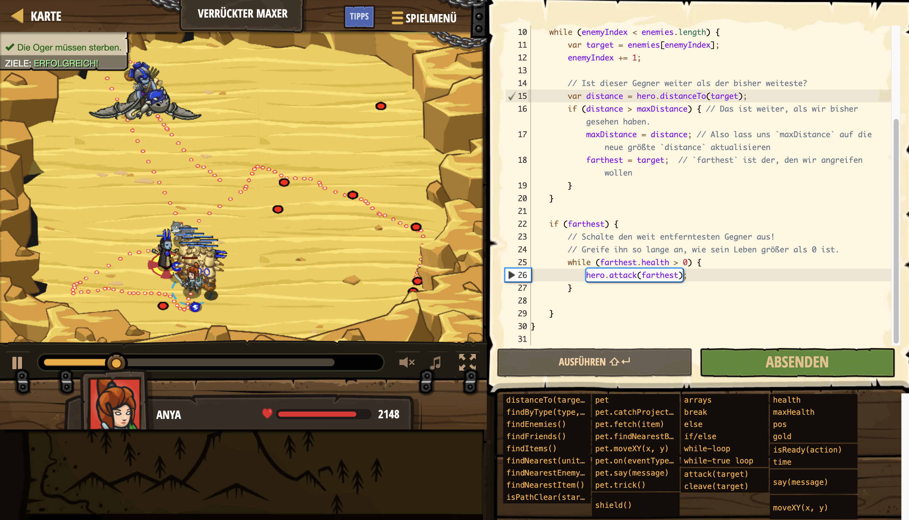

# Level Nummer: 23 - Verrückter Maxer



```js
// Töte den Gegner der am weitesten weg ist zuerst.

while(true) {
    var farthest = null;
    var maxDistance = 0;
    var enemyIndex = 0;
    var enemies = hero.findEnemies();

    // Betrachte alle Gegner um herauszufinden, welches derjenige ist, der am weitesten weg ist.
    while (enemyIndex < enemies.length) {
        var target = enemies[enemyIndex];
        enemyIndex += 1;

        // Ist dieser Gegner weiter als der bisher weiteste?
        var distance = hero.distanceTo(target);
        if (distance > maxDistance) { // Das ist weiter, als wir bisher gesehen haben.
            maxDistance = distance; // Also lass uns `maxDistance` auf die neue größte `distance` aktualisieren
            farthest = target;  // `farthest` ist der, den wir angreifen wollen
        }
    }

    if (farthest) {
        // Schalte den weit entferntesten Gegner aus!
        // Greife ihn so lange an, wie sein Leben größer als 0 ist.
        while (farthest.health > 0) {
            hero.attack(farthest);
        }
    }
}
```