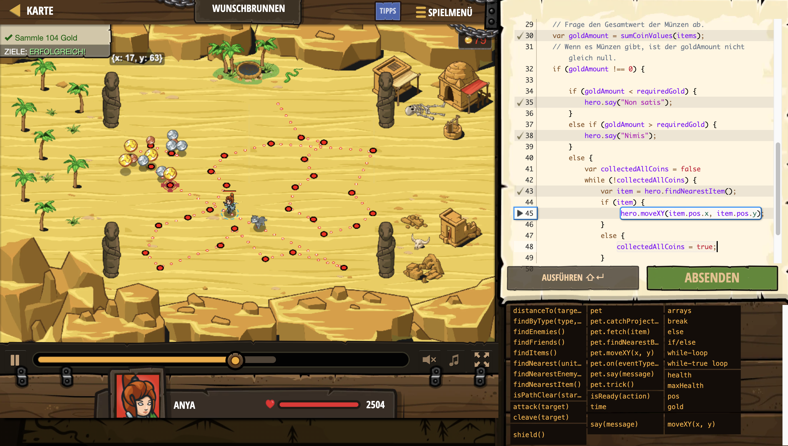

# Level Nummer: 26 - Wunschbrunnen



```js
// Du brauchst exakt 104 Gold.

var less = "Nimis";
var more = "Non satis";
var requiredGold = 104;

// Diese Funktion berechnet die Summe aller coin-Werte.
function sumCoinValues(coins) {
    var coinIndex = 0;
    var totalValue = 0;
    // Durchlaufe alle Münzen.
    while (coinIndex < coins.length) {
        totalValue += coins[coinIndex].value;
        coinIndex++;
    }
    return totalValue;
}

function collectAllCoins() {
    var item = hero.findNearest(hero.findItems());
    while (item) {
        hero.moveXY(item.pos.x, item.pos.y);
        item = hero.findNearest(hero.findItems());
    }
}

while (true) {
    var items = hero.findItems();
    // Frage den Gesamtwert der Münzen ab.
    var goldAmount = sumCoinValues(items);
    // Wenn es Münzen gibt, ist der goldAmount nicht gleich null.
    if (goldAmount !== 0) {

        if (goldAmount < requiredGold) {
            hero.say("Non satis");
        }
        else if (goldAmount > requiredGold) {
            hero.say("Nimis");
        }
        else {
            var collectedAllCoins = false
            while (!collectedAllCoins) {
                var item = hero.findNearestItem();
                if (item) {
                     hero.moveXY(item.pos.x, item.pos.y);
                }
                else {
                    collectedAllCoins = true;
                }
               
            }
        }
    }
}
```