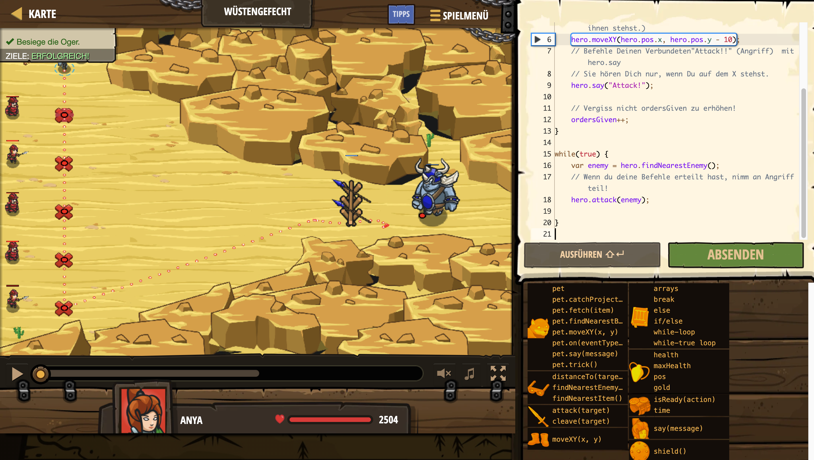

# Level Nummer: 13 - Wüstengefecht



```js
// While-Schleifen wiederholen sich so lange bis die Bedingung fasch (nicht mehr erfüllt) ist.

var ordersGiven = 0;
while (ordersGiven < 5) {
    // Bewege dich 10m nach unten und befehle jedem deiner Verbündeten sich in die Schlacht zu stürzen. (Sie können dich nur verstehen, wenn du direkt vor ihnen stehst.)
    hero.moveXY(hero.pos.x, hero.pos.y - 10);
    // Befehle Deinen Verbundeten"Attack!!" (Angriff)  mit hero.say
    // Sie hören Dich nur, wenn Du auf dem X stehst.
    hero.say("Attack!");

    // Vergiss nicht ordersGiven zu erhöhen!
    ordersGiven++;
}

while(true) {
    var enemy = hero.findNearestEnemy();
    // Wenn du deine Befehle erteilt hast, nimm an Angriff teil!
    hero.attack(enemy);   
}
```