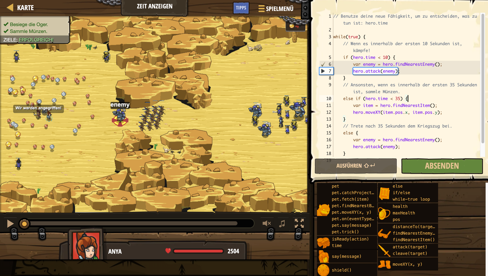

# Level Nummer: 9 - Zeit anzeigen



```js
// Benutze deine neue Fähigkeit, um zu entscheiden, was zu tun ist: hero.time

while(true) {
    // Wenn es innerhalb der ersten 10 Sekunden ist, kämpfe!
    if (hero.time < 10) {
        var enemy = hero.findNearestEnemy();
        hero.attack(enemy);
    }
    // Ansonsten, wenn es innerhalb der ersten 35 Sekunden ist, sammle Münzen.
    else if (hero.time < 35) {
        var item = hero.findNearestItem();
        hero.moveXY(item.pos.x, item.pos.y);
    }
    // Trete nach 35 Sekunden dem Kriegszug bei.
    else {
        var enemy = hero.findNearestEnemy();
        hero.attack(enemy);
    }
}
```