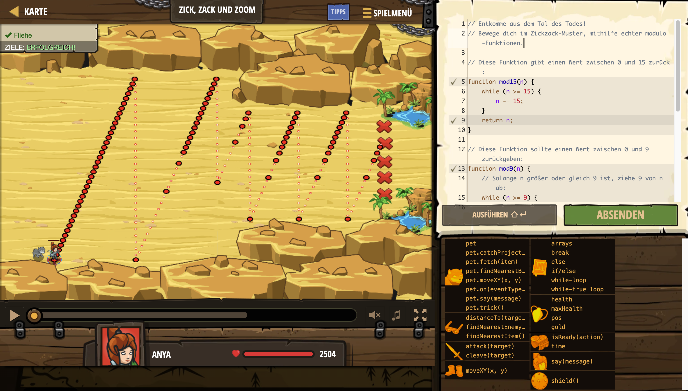

# Level Nummer: 16 - Zick, Zack und Zoom



```js
// Entkomme aus dem Tal des Todes!
// Bewege dich im Zickzack-Muster, mithilfe echter modulo-Funktionen.

// Diese Funktion gibt einen Wert zwischen 0 und 15 zurück:
function mod15(n) {
    while (n >= 15) {
        n -= 15;
    }
    return n;
}

// Diese Funktion sollte einen Wert zwischen 0 und 9 zurückgeben:
function mod9(n) {
    // Solange n größer oder gleich 9 ist, ziehe 9 von n ab:
    while (n >= 9) {
        n -= 9;
    }
    return n;
}

// Ändere den folgenden Code nicht:
while (true) {
    var time = hero.time;
    var x, y;
    if (time < 30) {
        y = 10 + 3 * mod15(time);
    } else {
        y = 20 + 3 * mod9(time);
    }
    x = 10 + time;
    hero.moveXY(x, y);
}
```