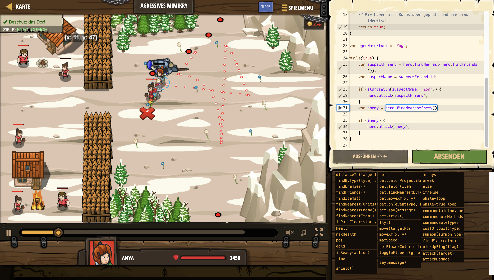

# Level Nummer: 18 - Agressives Mimikry



```js
// Beschütz das Dorf vor den Ogern.
// Sie nach Ogern, Bauern und als Bauern verkleidete Ogern.

// Diese Funktion überprüft, ob der Tet mit dem Wort beginnt.
function startsWith(text, word) {
    // Wenn das Wort länger als der Text ist:
    if(word.length > text.length) {
        return false;
    }
    // Wühl dich durch die Indexe von Wort und Text.
    for (var index = 0; index < word.length; index++) {
        // Wenn Buchstaben mit dem selben Index unterschiedlich sind:
        if (word[index] != text[index]) {
            // Dann stimmt das Wort nicht mit dem Text überein.
            return false;
        }
    }
    // Wir haben alle Buchstaben geprüft und sie sind identisch.
    return true;
}

var ogreNameStart = "Zog";

while(true) {
    var suspectFriend = hero.findNearest(hero.findFriends());
    var suspectName = suspectFriend.id;

    if (startsWith(suspectName, "Zog")) {
        hero.attack(suspectFriend);
    }
        
    var enemy = hero.findNearestEnemy();
    
    if (enemy) {
        hero.attack(enemy);
    }
    else {
        hero.moveXY(27, 27);
    }
}
```