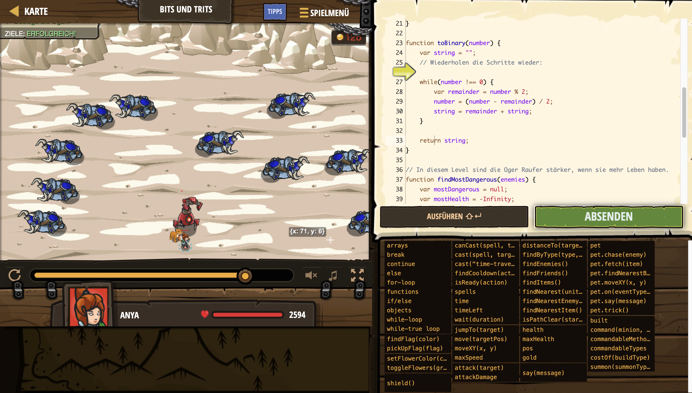

# Level Nummer: 32 - Bits und Trits



```js
// Oger Raufer kommen!
// Nutze den beschlagnahmten Roboter Läufer, um die Feinde in die Flucht zu jagen.
// Der Roboter Läufer benötigt Anweisungen in Form eines Stings ("Zeichenkette")
// Im ersten Teil der Zeichenkette, muss das Leben des Feinds ternär gesagt werden.
// Der zweite Teil der Zeichenkette, muss das Leben des Feinds binär gesagt werden.

function toTernary(number) {
    // Starte mit einer leeren Zeichenkette.
    var string = "";
    // Solange, die Zahl nicht 0 ist.
    while(number !== 0) {
        // Wir holen uns den Rest unserer Zahl.
        var remainder = number % 3;
        // Das ist unsere Iterator Methode. 'Anzahl' wird hier verringert.
        number = (number - remainder) / 3;
        // Hänge die Zeichenkette an den Rest.
        string = remainder + string;
    }
    // Endlich, wir wollen die zusammengesetzte Zeichenkette zurückgeben.
    return string;
}

function toBinary(number) {
    var string = "";
    // Wiederholen die Schritte wieder:
    
    while(number !== 0) {
        var remainder = number % 2;
        number = (number - remainder) / 2;
        string = remainder + string;
    }
    
    return string;
}

// In diesem Level sind die Oger Raufer stärker, wenn sie mehr Leben haben.
function findMostDangerous(enemies) {
    var mostDangerous = null;
    var mostHealth = -Infinity;
    for(var i = 0; i < enemies.length; i++) {
        var enemy = enemies[i];
        if(enemy.health > mostHealth) {
            mostDangerous = enemy;
            mostHealth = enemy.health;
        }
    }
    return mostDangerous;
}


while(true) {
    var enemies = hero.findEnemies();
    var dangerous = findMostDangerous(enemies);
    if(dangerous) {
        // Die Form wie der Roboter Kommandos entgegen nimmt ist:
        // ternary(enemyHealth) + " " + binary(enemyType)
        hero.say(toTernary(dangerous.health) + " " + toBinary(dangerous.type));
    }
}
```