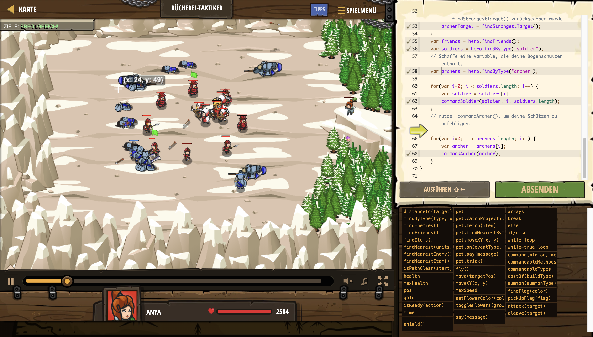

# Level Nummer: 15 - Bücherei-Taktiker



```js
// Hushbaum geriet in einen Hinterhalt der Oger!
// Sie ist so damit beschäftigt ihre Soldaten zu heilen, das du sie zum kämpfen kommandieren solltest!
// Die Oger werden mehr Truppen senden, wenn sie glauben, dass sie Hushbaum oder deine Schützen kriegen können, daher sollstest du sie im Kreis belassen.

var archerTarget = null;

// Soldaten verteilen sich im Kreis und verteidigen.
function commandSoldier(soldier, soldierIndex, numSoldiers) {
    var angle = Math.PI * 2 * soldierIndex / numSoldiers;
    var defendPos = {x: 41, y: 40};
    defendPos.x += 10 * Math.cos(angle);
    defendPos.y += 10 * Math.sin(angle);
    hero.command(soldier, "defend", defendPos);
}

// Finde das Stärkste Ziel (größte Gesundheit)
// Diese Funktion gibt etwas zurück! Wenn du diese Funktion aufrufst, erhältst du einen Rückgabewert.
function findStrongestTarget() {
    var mostHealth = 0;
    var bestTarget = null;
    var enemies = hero.findEnemies();
    // Finde heraus welcher Feind am meisten Gesundheit besitzt und setze bestTarget auf diesen Feind.
    for (let i = 0; i < enemies.length; i++) {
        let enemy = enemies[i];
        if (enemy.health > mostHealth) {
            bestTarget = enemy
        }
    }
    // Die Feuerkraft der Schützen nur dann fokussieren, wenn es sich um einen großen Oger handelt.
    if (bestTarget && bestTarget.health > 15) {
        return bestTarget;
    } else {
        return null;
    }
}


// Wenn das stärkste Ziel mehr als 15 Leben besitzt, attackiere dieses Ziel. Ansonsten attackiere das näheste Ziel.
function commandArcher(archer) {
    var nearest = archer.findNearestEnemy();
    if(archerTarget) {
        hero.command(archer, "attack", archerTarget);
    } else if(nearest) {
        hero.command(archer, "attack", nearest);
    }
}


while(true) {
    // Wenn ein archterTarget besiegt ist oder nicht vorhanden ist, finde ein neues.
    if(!archerTarget || archerTarget.health <= 0) {
        // Setze archterTarget auf das Ziel, das von findStrongestTarget() zurückgegeben wurde.
        archerTarget = findStrongestTarget();
    }
    var friends = hero.findFriends();
    var soldiers = hero.findByType("soldier");
    // Schaffe eine Variable, die deine Bogenschützen enthält.
    var archers = hero.findByType("archer");
    
    for(var i=0; i < soldiers.length; i++) {
        var soldier = soldiers[i];
        commandSoldier(soldier, i, soldiers.length);
    }
    // nutze  commandArcher(), um deine Schützen zu befehligen.
    
    for(var i=0; i < archers.length; i++) {
        var archer = archers[i];
        commandArcher(archer);
    }
}
```